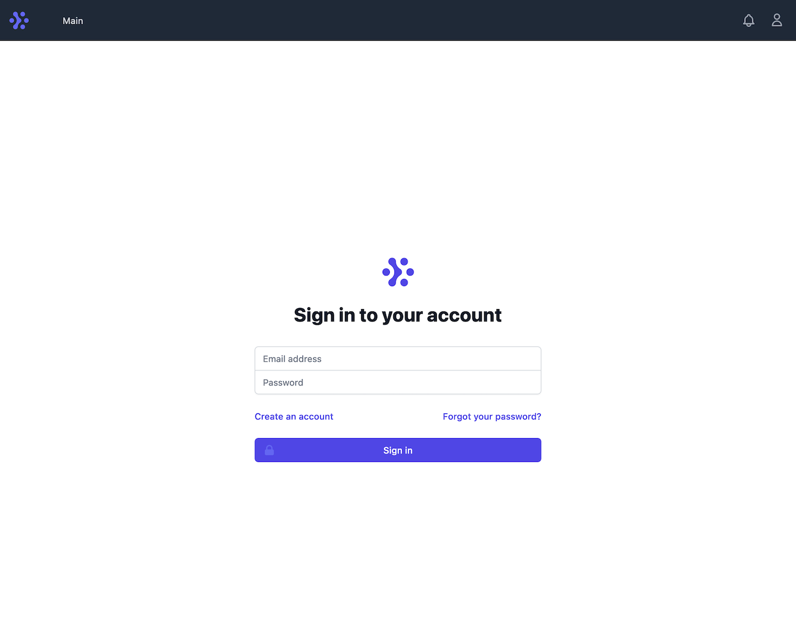
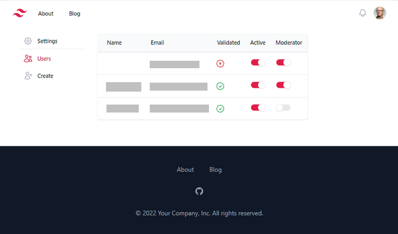
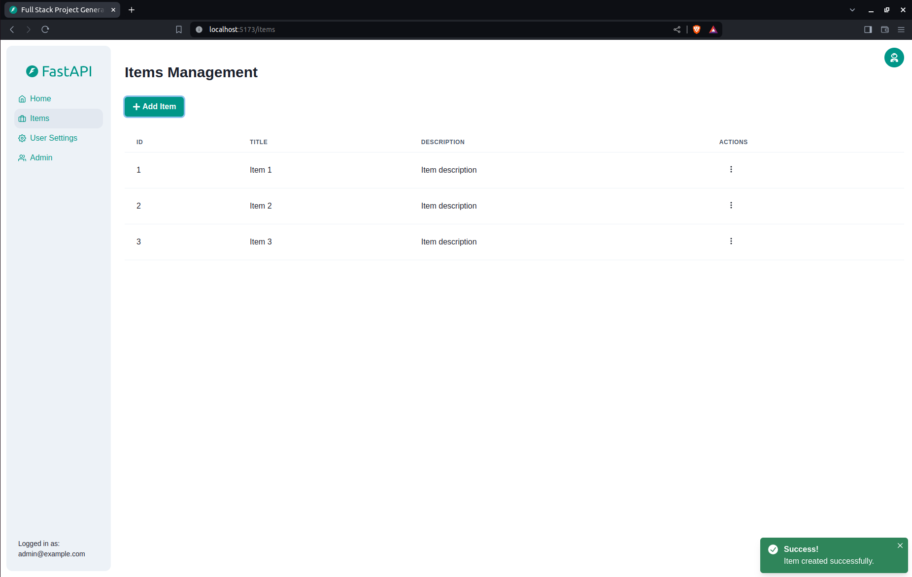
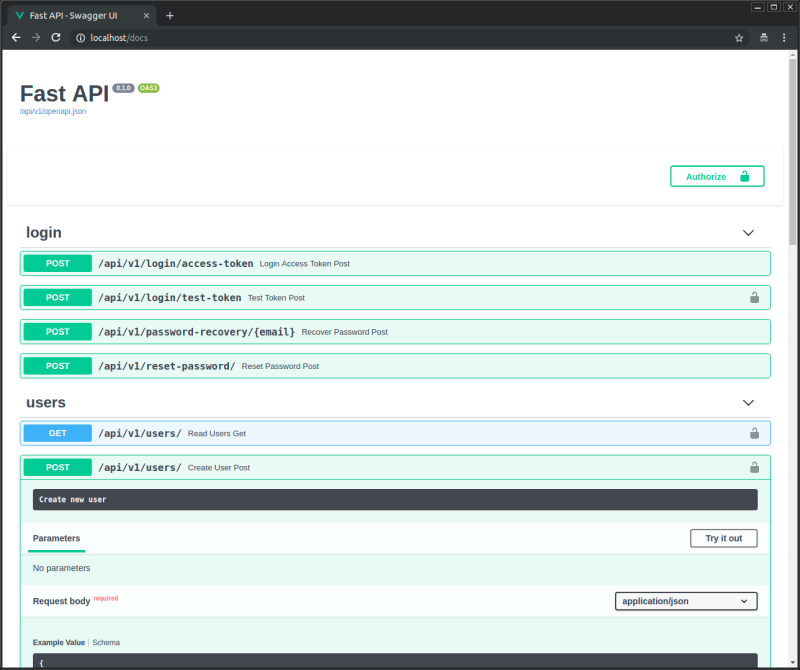

# Role-Based Access Control (RBAC) Implementation

This fork extends the original [Full Stack FastAPI Template](#full-stack-fastapi-template) with role-based access control. The original template README follows below.

## Quick Start

This solution runs **without Docker** against a local Postgres install. Due to insufficient free disk space on my machine, I spent ≈ 1 hour bringing the backend up natively (Postgres + uv + alembic + initial data seed) instead of using `docker compose`. The instructions below reflect this setup; the original Docker-based workflow from the upstream template still works if you have the disk space for it.

### Prerequisites

- Python 3.12
- [uv](https://docs.astral.sh/uv/) for dependency management
- PostgreSQL 18 running on `localhost:5432`
- Node.js 22 and npm (for the frontend)

### Backend Setup

1. Create a database named `app` in your local Postgres:

```sql
   CREATE DATABASE app;
```

2. Copy `.env` into the backend folder so the app finds its config:

```bash
   cd backend
   cp ../.env .
```

Defaults in `.env` are tuned for local development. The Postgres password is `changethis`; adjust if your local Postgres uses a different one.

3. Install dependencies and apply migrations:

```bash
   uv sync
   uv run alembic upgrade head
```

4. Seed test users (one per role):

```bash
   uv run python -m app.initial_data
```

This creates three users in the `local` environment:

| Email               | Password   | Role    |
| ------------------- | ---------- | ------- |
| admin@example.com   | changethis | admin   |
| manager@example.com | changethis | manager |
| member@example.com  | changethis | member  |

5. Run the backend:

```bash
   uv run fastapi run --reload app/main.py
```

API and Swagger UI are at <http://localhost:8000/docs>.

### Frontend Setup

In a second terminal:

```bash
cd frontend
npm install
npm run dev
```

The app opens at <http://localhost:5173>. Log in with any of the three seeded users above to see how the UI adapts to each role.

> If you change the backend's OpenAPI schema (new endpoints, new fields), regenerate the typed client:
>
> ```bash
> cd frontend
> Invoke-WebRequest -Uri "http://localhost:8000/api/v1/openapi.json" -OutFile "openapi.json"  # PowerShell
> # or: curl http://localhost:8000/api/v1/openapi.json -o openapi.json                        # bash
> npm run generate-client
> ```

### Running Tests

```bash
cd backend
uv run pytest
```

RBAC-specific tests live in `backend/app/tests/api/routes/test_rbac.py`.

> **Note:** the test suite shares the development database and wipes user tables on teardown. After running tests, re-run `uv run python -m app.initial_data` to restore the three seed users.

## Permission Matrix

| Action                | admin | manager | member |
| --------------------- | :---: | :-----: | :----: |
| List all users        |   ✓   |    ✓    |   ✗    |
| Create user           |   ✓   |    ✗    |   ✗    |
| View metrics          |   ✓   |    ✓    |   ✗    |
| View own profile      |   ✓   |    ✓    |   ✓    |
| Update own profile    |   ✓   |    ✓    |   ✓    |
| View any user profile |   ✓   |    ✗    |   ✗    |
| Update any user       |   ✓   |    ✗    |   ✗    |
| Delete any user       |   ✓   |    ✗    |   ✗    |
| Delete own account    |   ✗   |    ✓    |   ✓    |

Admins cannot delete their own account to prevent locking out of the system.

## Authorization Approach

**Backend — where checks live.** Authorization is implemented as a FastAPI dependency factory, `require_role(*allowed_roles)`, defined in `backend/app/api/deps.py`. The factory returns a sub-dependency that consumes the already-authenticated `CurrentUser` and raises `HTTPException(403)` if the user's role is not in the allowed set. Each protected endpoint declares its policy in the route decorator, e.g. `dependencies=[Depends(require_role(UserRole.ADMIN, UserRole.MANAGER))]`. This keeps the policy declaration next to the route, makes it grep-able, and lets FastAPI handle the wiring.

**Backend — how roles are stored.** Roles are a string-based Python `Enum` (`UserRole` in `backend/app/models.py`) persisted as a plain `VARCHAR` column on the `user` table. Storing as a string (rather than a Postgres ENUM type) keeps migrations simple — adding a new role requires no schema change, only Python and frontend updates. Pydantic validates incoming values against the enum at the API boundary.

**Frontend — how capabilities are exposed.** The `/users/me` endpoint returns the full user object including `role` (it's part of `UserBase`, so it ships in every `UserPublic` response automatically). The frontend reads this on login via `useAuth` and caches it in React Query. A single permission module at `frontend/src/lib/auth/permissions.ts` defines the policy as a `Record<Action, UserRole[]>` and exposes one helper, `can(user, action)`. Every UI decision — sidebar items, action buttons, table columns — flows through `can()`, so the entire frontend policy lives in one file. Adding a new role or action is a one-line change in that record.

**Frontend — defense in depth.** UI hiding alone isn't enough; users can still type unauthorized URLs. Three layers protect against this: (1) `beforeLoad` guards on protected routes (`/admin`, `/metrics`) call `/users/me` and redirect to `/forbidden` if the role doesn't fit; (2) a global React Query error handler in `main.tsx` catches any 403 returned from the API and redirects to `/forbidden` automatically — useful when backend policy is stricter than the frontend expects, or evolves over time; (3) the backend itself is the source of truth and rejects any unauthorized request regardless of how the request was made. Frontend checks exist for UX only.

**Conditional logic.** A small number of endpoints have access rules that depend on the _target_ of the action (e.g. `GET /users/{user_id}` — your own profile is always visible, others are admin-only). For these, the check lives inline in the route body rather than in a dependency, since dependencies can't see path parameters cleanly. This is a deliberate trade-off; see `NOTES.md`.

---

# Full Stack FastAPI Template

<a href="https://github.com/fastapi/full-stack-fastapi-template/actions?query=workflow%3A%22Test+Docker+Compose%22" target="_blank"></a>
<a href="https://github.com/fastapi/full-stack-fastapi-template/actions?query=workflow%3A%22Test+Backend%22" target="_blank"></a>
<a href="https://coverage-badge.samuelcolvin.workers.dev/redirect/fastapi/full-stack-fastapi-template" target="_blank"></a>

## Technology Stack and Features

- ⚡ [**FastAPI**](https://fastapi.tiangolo.com) for the Python backend API.
  - 🧰 [SQLModel](https://sqlmodel.tiangolo.com) for the Python SQL database interactions (ORM).
  - 🔍 [Pydantic](https://docs.pydantic.dev), used by FastAPI, for the data validation and settings management.
  - 💾 [PostgreSQL](https://www.postgresql.org) as the SQL database.
- 🚀 [React](https://react.dev) for the frontend.
  - 💃 Using TypeScript, hooks, [Vite](https://vitejs.dev), and other parts of a modern frontend stack.
  - 🎨 [Tailwind CSS](https://tailwindcss.com) and [shadcn/ui](https://ui.shadcn.com) for the frontend components.
  - 🤖 An automatically generated frontend client.
  - 🧪 [Playwright](https://playwright.dev) for End-to-End testing.
  - 🦇 Dark mode support.
- 🐋 [Docker Compose](https://www.docker.com) for development and production.
- 🔒 Secure password hashing by default.
- 🔑 JWT (JSON Web Token) authentication.
- 📫 Email based password recovery.
- 📬 [Mailcatcher](https://mailcatcher.me) for local email testing during development.
- ✅ Tests with [Pytest](https://pytest.org).
- 📞 [Traefik](https://traefik.io) as a reverse proxy / load balancer.
- 🚢 Deployment instructions using Docker Compose, including how to set up a frontend Traefik proxy to handle automatic HTTPS certificates.
- 🏭 CI (continuous integration) and CD (continuous deployment) based on GitHub Actions.

### Dashboard Login

[](https://github.com/fastapi/full-stack-fastapi-template)

### Dashboard - Admin

[](https://github.com/fastapi/full-stack-fastapi-template)

### Dashboard - Items

[](https://github.com/fastapi/full-stack-fastapi-template)

### Dashboard - Dark Mode

[](https://github.com/fastapi/full-stack-fastapi-template)

### Interactive API Documentation

[](https://github.com/fastapi/full-stack-fastapi-template)

## How To Use It

You can **just fork or clone** this repository and use it as is.

✨ It just works. ✨

### How to Use a Private Repository

If you want to have a private repository, GitHub won't allow you to simply fork it as it doesn't allow changing the visibility of forks.

But you can do the following:

- Create a new GitHub repo, for example `my-full-stack`.
- Clone this repository manually, set the name with the name of the project you want to use, for example `my-full-stack`:

```bash
git clone git@github.com:fastapi/full-stack-fastapi-template.git my-full-stack
```

- Enter into the new directory:

```bash
cd my-full-stack
```

- Set the new origin to your new repository, copy it from the GitHub interface, for example:

```bash
git remote set-url origin git@github.com:octocat/my-full-stack.git
```

- Add this repo as another "remote" to allow you to get updates later:

```bash
git remote add upstream git@github.com:fastapi/full-stack-fastapi-template.git
```

- Push the code to your new repository:

```bash
git push -u origin master
```

### Update From the Original Template

After cloning the repository, and after doing changes, you might want to get the latest changes from this original template.

- Make sure you added the original repository as a remote, you can check it with:

```bash
git remote -v

origin    git@github.com:octocat/my-full-stack.git (fetch)
origin    git@github.com:octocat/my-full-stack.git (push)
upstream    git@github.com:fastapi/full-stack-fastapi-template.git (fetch)
upstream    git@github.com:fastapi/full-stack-fastapi-template.git (push)
```

- Pull the latest changes without merging:

```bash
git pull --no-commit upstream master
```

This will download the latest changes from this template without committing them, that way you can check everything is right before committing.

- If there are conflicts, solve them in your editor.

- Once you are done, commit the changes:

```bash
git merge --continue
```

### Configure

You can then update configs in the `.env` files to customize your configurations.

Before deploying it, make sure you change at least the values for:

- `SECRET_KEY`
- `FIRST_SUPERUSER_PASSWORD`
- `POSTGRES_PASSWORD`

You can (and should) pass these as environment variables from secrets.

Read the [deployment.md](./deployment.md) docs for more details.

### Generate Secret Keys

Some environment variables in the `.env` file have a default value of `changethis`.

You have to change them with a secret key, to generate secret keys you can run the following command:

```bash
python -c "import secrets; print(secrets.token_urlsafe(32))"
```

Copy the content and use that as password / secret key. And run that again to generate another secure key.

## How To Use It - Alternative With Copier

This repository also supports generating a new project using [Copier](https://copier.readthedocs.io).

It will copy all the files, ask you configuration questions, and update the `.env` files with your answers.

### Install Copier

You can install Copier with:

```bash
pip install copier
```

Or better, if you have [`pipx`](https://pipx.pypa.io/), you can run it with:

```bash
pipx install copier
```

**Note**: If you have `pipx`, installing copier is optional, you could run it directly.

### Generate a Project With Copier

Decide a name for your new project's directory, you will use it below. For example, `my-awesome-project`.

Go to the directory that will be the parent of your project, and run the command with your project's name:

```bash
copier copy https://github.com/fastapi/full-stack-fastapi-template my-awesome-project --trust
```

If you have `pipx` and you didn't install `copier`, you can run it directly:

```bash
pipx run copier copy https://github.com/fastapi/full-stack-fastapi-template my-awesome-project --trust
```

**Note** the `--trust` option is necessary to be able to execute a [post-creation script](https://github.com/fastapi/full-stack-fastapi-template/blob/master/.copier/update_dotenv.py) that updates your `.env` files.

### Input Variables

Copier will ask you for some data, you might want to have at hand before generating the project.

But don't worry, you can just update any of that in the `.env` files afterwards.

The input variables, with their default values (some auto generated) are:

- `project_name`: (default: `"FastAPI Project"`) The name of the project, shown to API users (in .env).
- `stack_name`: (default: `"fastapi-project"`) The name of the stack used for Docker Compose labels and project name (no spaces, no periods) (in .env).
- `secret_key`: (default: `"changethis"`) The secret key for the project, used for security, stored in .env, you can generate one with the method above.
- `first_superuser`: (default: `"admin@example.com"`) The email of the first superuser (in .env).
- `first_superuser_password`: (default: `"changethis"`) The password of the first superuser (in .env).
- `smtp_host`: (default: "") The SMTP server host to send emails, you can set it later in .env.
- `smtp_user`: (default: "") The SMTP server user to send emails, you can set it later in .env.
- `smtp_password`: (default: "") The SMTP server password to send emails, you can set it later in .env.
- `emails_from_email`: (default: `"info@example.com"`) The email account to send emails from, you can set it later in .env.
- `postgres_password`: (default: `"changethis"`) The password for the PostgreSQL database, stored in .env, you can generate one with the method above.
- `sentry_dsn`: (default: "") The DSN for Sentry, if you are using it, you can set it later in .env.

## Backend Development

Backend docs: [backend/README.md](./backend/README.md).

## Frontend Development

Frontend docs: [frontend/README.md](./frontend/README.md).

## Deployment

Deployment docs: [deployment.md](./deployment.md).

## Development

General development docs: [development.md](./development.md).

This includes using Docker Compose, custom local domains, `.env` configurations, etc.

## Release Notes

Check the file [release-notes.md](./release-notes.md).

## License

The Full Stack FastAPI Template is licensed under the terms of the MIT license.
