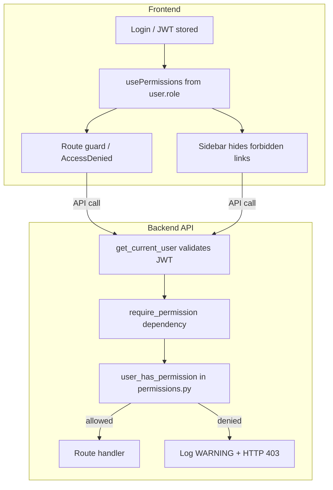
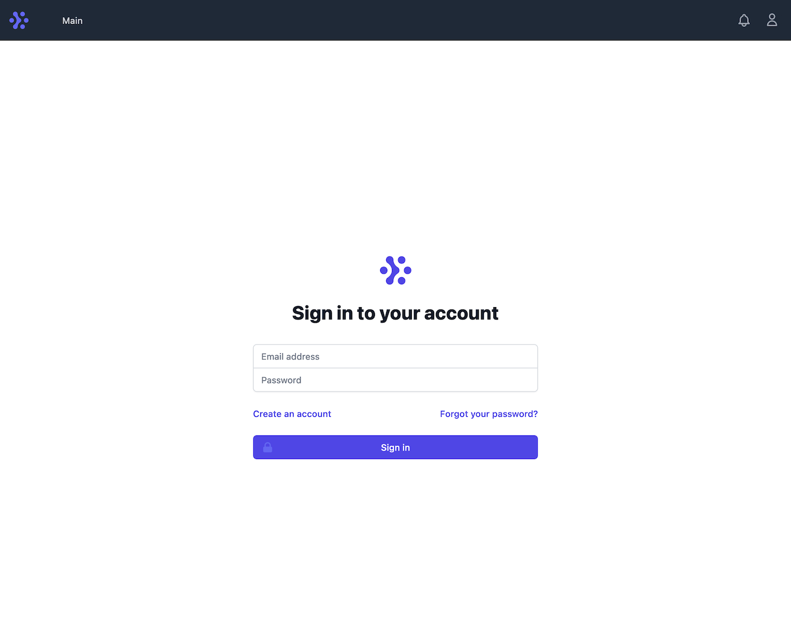
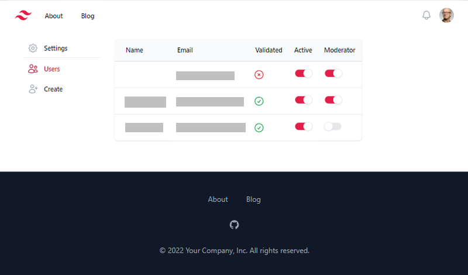
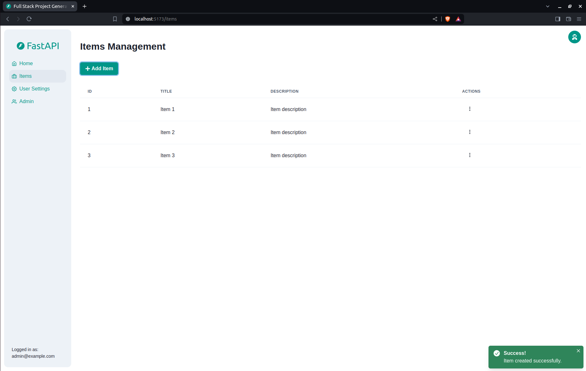
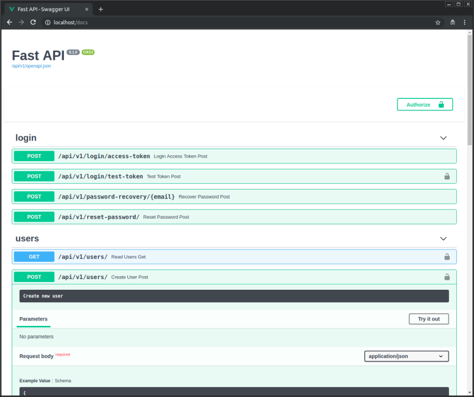

# Full Stack FastAPI Template — RBAC Extension

This project extends the [Full Stack FastAPI Template](https://github.com/fastapi/full-stack-fastapi-template) with role-based access control (RBAC) for the [Fullstack Dev Test Task](https://github.com/evios/Fullstack-Dev-Test-Task).

## Quick Start (Docker)

Requires [Docker Desktop](https://www.docker.com/products/docker-desktop/) (macOS, Linux, or Windows).

```bash
git clone <repository-url>
cd <project-directory>
cp compose.override.example.yml compose.override.yml
docker compose build backend
docker compose run --rm backend bash scripts/prestart.sh
docker compose up -d
```

Open:

| Service | URL |
|---------|-----|
| App (API + frontend) | http://localhost:8000 |
| API docs | http://localhost:8000/docs |
| Adminer | http://localhost:8080 |
| Mailpit | http://localhost:8025 |
| Traefik (via proxy) | http://localhost |

`compose.override.yml` is local-only (see `compose.override.example.yml`). Adjust ports there if `80` or `5432` are already in use on your machine.

## Seed Users

| Email | Password | Role |
|-------|----------|------|
| admin@example.com | changethis | admin |
| manager@example.com | changethis | manager |
| member@example.com | changethis | member |

Credentials are configured in `.env` (`FIRST_SUPERUSER*`, `MANAGER_USER*`, `MEMBER_USER*`).

## Permission Matrix

| Action | admin | manager | member |
|--------|:-----:|:-------:|:------:|
| List all users | yes | yes | no |
| Create user | yes | no | no |
| View metrics | yes | yes | no |
| Update own profile | yes | yes | yes |
| Update any profile | yes | no | no |
| Global settings | yes | no | no |

## Authorization Approach

Roles are stored on the `User.role` column (`admin`, `manager`, `member`) with an Alembic migration backfilling existing superusers to `admin`.

Backend authorization is centralized in `backend/app/core/permissions.py`. FastAPI dependencies in `backend/app/api/deps.py` expose `require_permission(...)` and enforce checks on route handlers (users, metrics). The API returns HTTP `403` with a clear message when access is denied.

The frontend mirrors the same permission matrix in `frontend/src/lib/permissions.ts`. The `usePermissions()` hook drives sidebar visibility, route-level UI guards, and an `AccessDenied` component for direct navigation to forbidden pages. The backend remains the source of truth; the UI only hides or blocks navigation for better UX.

Denied access attempts are logged at `WARNING` level from `app.api.deps` (user id, email, role, permission) for observability.

### Authorization Flow


```mermaid
flowchart TB
  subgraph client [Frontend]
    Login[Login / JWT stored]
    Hook[usePermissions from user.role]
    Nav[Sidebar hides forbidden links]
    Guard[Route guard / AccessDenied]
    Login --> Hook --> Nav
    Hook --> Guard
  end

  subgraph api [Backend API]
    JWT[get_current_user validates JWT]
    Perm[require_permission dependency]
    Matrix[user_has_permission in permissions.py]
    Route[Route handler]
    JWT --> Perm --> Matrix
    Matrix -->|allowed| Route
    Matrix -->|denied| Log403[Log WARNING + HTTP 403]
  end

  Guard -->|API call| JWT
  Nav -->|API call| JWT
```

Further reading:

- [NOTES.md](NOTES.md) — scope cuts, trade-offs, follow-ups
- [docs/ai-conversations/](docs/ai-conversations/) — English copies of AI-assisted development sessions (submission requirement)
- [docs/adr/001-permission-based-rbac.md](docs/adr/001-permission-based-rbac.md)
- [docs/adr/002-frontend-permission-mirror.md](docs/adr/002-frontend-permission-mirror.md)

## Running Tests

```bash
# Authorization-focused tests (rebuild backend image after pulling changes)
docker compose run --rm backend pytest tests/api/routes/test_authorization.py -v

# Smoke check (Python 3 on the host; stack must be up)
python3 scripts/smoke_rbac.py
```

## Database Migrations

```bash
docker compose run --rm backend alembic upgrade head
```

New migration: `a1b2c3d4e5f6_add_user_role.py` (adds `role` column).

---

# Full Stack FastAPI Template

[](../../actions/workflows/test-docker-compose.yml)
[](../../actions/workflows/test-backend.yml)

## Technology Stack and Features

- ⚡ [**FastAPI**](https://fastapi.tiangolo.com) for the Python backend API.
  - 🧰 [SQLModel](https://sqlmodel.tiangolo.com) for the Python SQL database interactions (ORM).
  - 🔍 [Pydantic](https://docs.pydantic.dev), used by FastAPI, for the data validation and settings management.
  - 💾 [PostgreSQL](https://www.postgresql.org) as the SQL database.
- 🚀 [React](https://react.dev) for the frontend.
  - 🧩 Built into the backend application and served by FastAPI on the same domain as the API.
  - 💃 Using TypeScript, hooks, [Vite](https://vitejs.dev), and other parts of a modern frontend stack.
  - 🎨 [Tailwind CSS](https://tailwindcss.com) and [shadcn/ui](https://ui.shadcn.com) for the frontend components.
  - 🤖 An automatically generated frontend client.
  - 🧪 [Playwright](https://playwright.dev) for end-to-end testing.
  - 🦇 Dark mode support.
- ☁️ [FastAPI Cloud](https://fastapicloud.com) for deployment.
- 🐋 [Docker Compose](https://www.docker.com) for local services and self-hosted deployment.
  - 📞 [Traefik](https://traefik.io) as a reverse proxy with automatic HTTPS.
- 🔒 Secure password hashing by default.
- 🔑 JWT (JSON Web Token) authentication.
- 📫 Email-based password recovery.
- 📬 [Mailpit](https://mailpit.axllent.org) for local email testing during development.
- ✅ Tests with [Pytest](https://pytest.org).
- 🏭 CI (continuous integration) and CD (continuous deployment) based on GitHub Actions.

### Dashboard Login



### Dashboard - Admin



### Dashboard - Items



### Dashboard - Dark Mode


### Interactive API Documentation



## How to Use It

Click the **Use this template** button at the top of this page to create a new repository.

## Backend Development

Backend docs: [backend/README.md](./backend/README.md).

## Frontend Development

Frontend docs: [frontend/README.md](./frontend/README.md).

## Deployment

FastAPI Cloud deployment: [deployment.md](./deployment.md).

Self-hosted deployment with Docker Compose: [deployment-docker-compose.md](./deployment-docker-compose.md).

## Development

General development docs: [development.md](./development.md).

This includes the local FastAPI and Vite workflow, Docker Compose services, `.env` configuration, and more.

## Release Notes

Check the file [release-notes.md](./release-notes.md).

## License

The Full Stack FastAPI Template is licensed under the terms of the MIT license.
