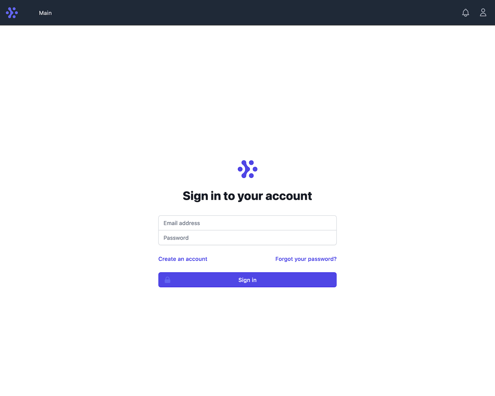
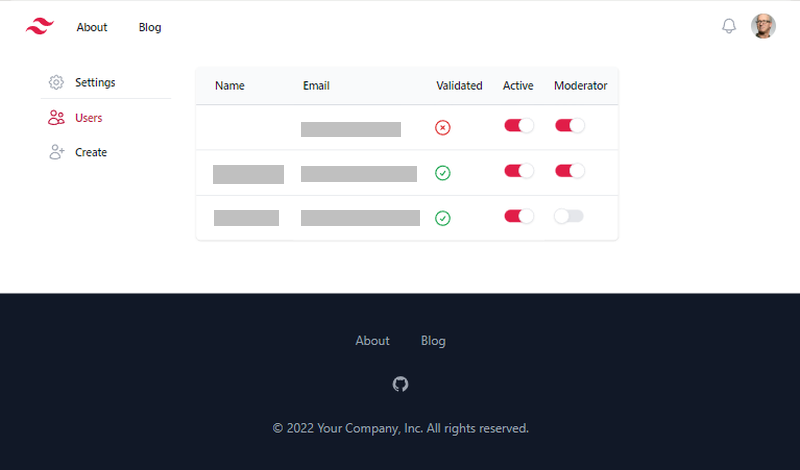
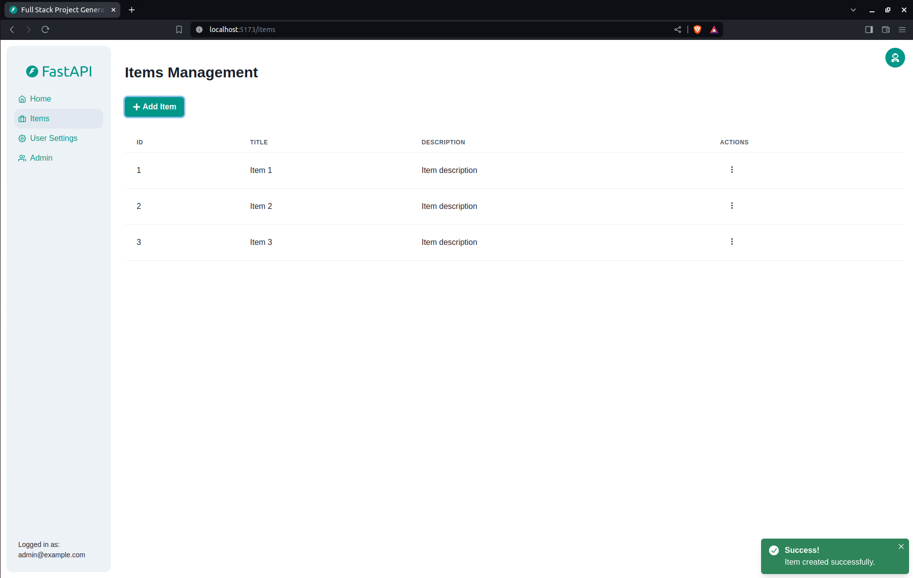
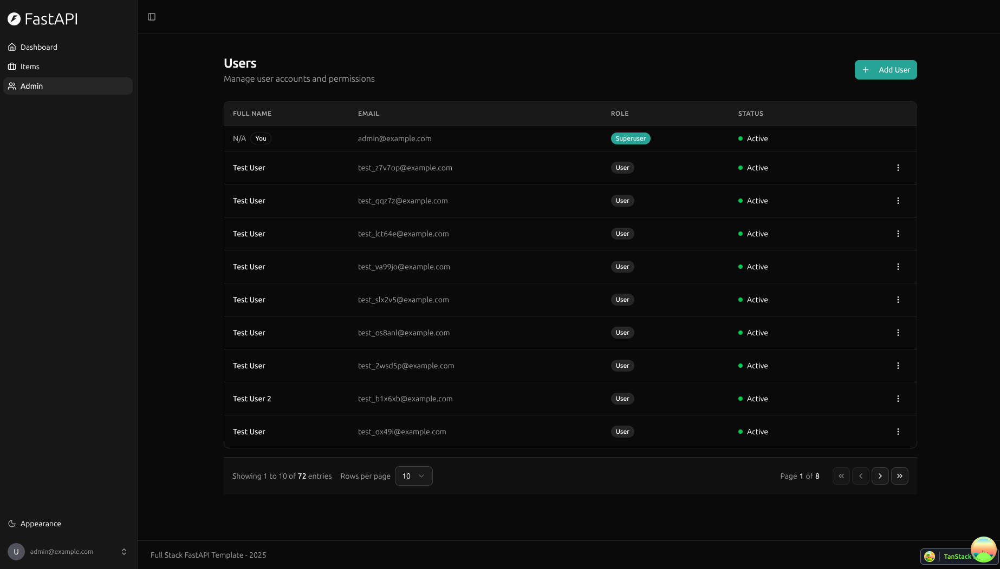
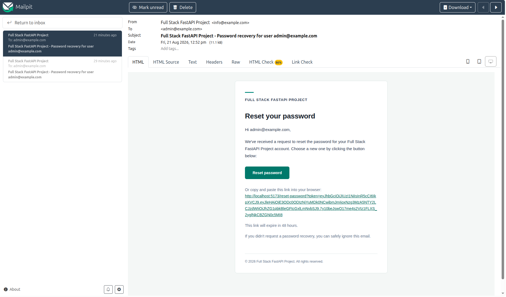
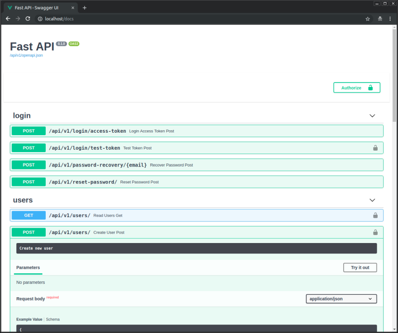

# Full Stack FastAPI Template

[](../../actions/workflows/test-docker-compose.yml)
[](../../actions/workflows/test-backend.yml)

## Technology Stack and Features

- ⚡ [**FastAPI**](https://fastapi.tiangolo.com) for the Python backend API.
  - 🧰 [SQLModel](https://sqlmodel.tiangolo.com) for the Python SQL database interactions (ORM).
  - 🔍 [Pydantic](https://docs.pydantic.dev), used by FastAPI, for the data validation and settings management.
  - 💾 [PostgreSQL](https://www.postgresql.org) as the SQL database.
- 🚀 [React](https://react.dev) for the frontend.
  - 🧩 Built into the backend application and served by FastAPI on the same domain as the API.
  - 💃 Using TypeScript, hooks, [Vite](https://vitejs.dev), and other parts of a modern frontend stack.
  - 🎨 [Tailwind CSS](https://tailwindcss.com) and [shadcn/ui](https://ui.shadcn.com) for the frontend components.
  - 🤖 An automatically generated frontend client.
  - 🧪 [Playwright](https://playwright.dev) for end-to-end testing.
  - 🦇 Dark mode support.
- ☁️ [FastAPI Cloud](https://fastapicloud.com) for deployment.
- 🐋 [Docker Compose](https://www.docker.com) for local services and self-hosted deployment.
  - 📞 [Traefik](https://traefik.io) as a reverse proxy with automatic HTTPS.
- 🔒 Secure password hashing by default.
- 🔑 JWT (JSON Web Token) authentication.
- 📫 Email-based password recovery.
- ✉️ [React Email](https://react.email) for email templates.
- 📬 [Mailpit](https://mailpit.axllent.org) for local email testing during development.
- ✅ Tests with [Pytest](https://pytest.org).
- 🏭 CI (continuous integration) and CD (continuous deployment) based on GitHub Actions.

### Dashboard Login



### Dashboard - Admin



### Dashboard - Items



### Dashboard - Dark Mode



### React Email Templates


### Mailpit - Local Email Testing



### Interactive API Documentation



## How to Use It

Click the **Use this template** button at the top of this page to create a new repository.

## Backend Development

Backend docs: [backend/README.md](./backend/README.md).

## Frontend Development

Frontend docs: [frontend/README.md](./frontend/README.md).

## Deployment

FastAPI Cloud deployment: [deployment.md](./deployment.md).

Self-hosted deployment with Docker Compose: [deployment-docker-compose.md](./deployment-docker-compose.md).

## Production Hardening

The template ships with JWT authentication, secure password hashing, and CORS middleware in `backend/app/main.py`, but it deliberately does not include request-level protections such as per-client rate limiting, payload inspection, or bot/probe filtering. A reverse proxy or CDN can enforce some of these controls at the edge, but edge controls complement rather than replace application-layer middleware, which also covers traffic that never crosses your edge rules.

Established application-layer options for FastAPI:

- [slowapi](https://github.com/laurentS/slowapi): per-route rate limits via a decorator or parameter; a minimal, low-dependency choice.
- [fastapi-limiter](https://github.com/long2ice/fastapi-limiter): Redis-backed rate limiting with per-route decorators.
- [fastapi-guard](https://github.com/rennf93/fastapi-guard): a broader middleware with a 17-check pipeline (penetration-pattern detection, IP and cloud-provider blocking, behavioral tracking) and a passive, log-only mode for previewing what would be blocked before enforcing.

For example, wiring `fastapi-guard` into `backend/app/main.py` in passive mode starts log-only; once the logs show what would be blocked, the same rules are enforced by flipping one flag:

```python
from guard import SecurityConfig, SecurityMiddleware

app.add_middleware(
    SecurityMiddleware,
    config=SecurityConfig(
        passive_mode=True,  # log only; set to False to enforce
        enable_rate_limiting=True,
        rate_limit=100,
        rate_limit_window=60,
        block_cloud_providers={"AWS", "GCP", "Azure"},
        custom_log_file="security.log",
    ),
)
```

Application-layer middleware does not cover authentication and authorization, IDOR and other business-logic flaws, or volumetric DDoS, which needs mitigation upstream of the application. Treat it as one layer among several, not a complete security story. The Traefik reverse proxy included in the self-hosted deployment (see [deployment-docker-compose.md](./deployment-docker-compose.md)) can additionally enforce controls such as rate limiting at the edge.

## Development

General development docs: [development.md](./development.md).

This includes the local FastAPI and Vite workflow, Docker Compose services, `.env` configuration, and more.

## Release Notes

Check the file [release-notes.md](./release-notes.md).

## License

The Full Stack FastAPI Template is licensed under the terms of the MIT license.
