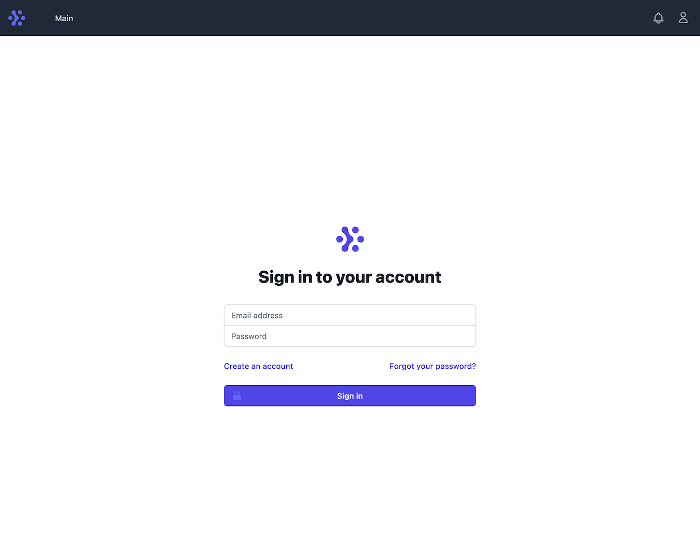
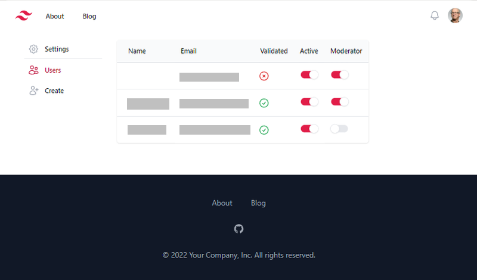
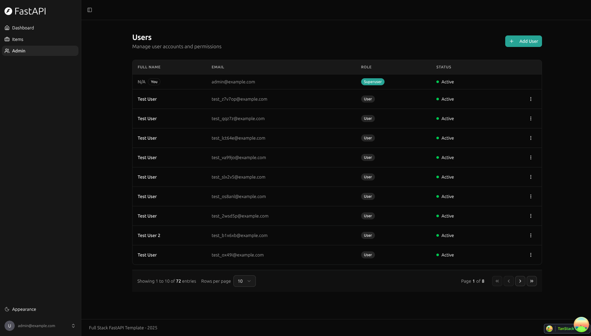
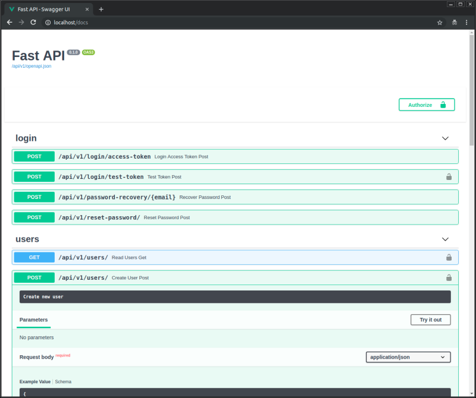

# 全栈 FastAPI 模板项目

<a href="https://github.com/fastapi/full-stack-fastapi-template/actions?query=workflow%3ATest" target="_blank"></a>
<a href="https://coverage-badge.samuelcolvin.workers.dev/redirect/fastapi/full-stack-fastapi-template" target="_blank"></a>

## 项目简介

本项目是一个基于 FastAPI + React 的全栈开发模板，前后端分离，支持本地开发与生产部署，适合快速搭建中大型管理系统、SaaS 平台等。

## 技术栈

- ⚡ **后端**：FastAPI、SQLModel、Pydantic、PostgreSQL
- 🚀 **前端**：React、TypeScript、Vite、Chakra UI
- 🧪 **测试**：Pytest、Playwright
- 🐋 **容器化**：Docker Compose 支持
- 🔒 JWT 认证、邮箱找回密码、超级用户权限
- 📚 自动生成的 API 文档（Swagger UI）
- 🌑 支持暗黑模式

## 功能演示

### 登录页



### 后台管理



### 创建用户


### 数据项管理


### 用户设置


### 暗黑模式



### API 文档



---

## 本地运行与开发

### 1. 安装依赖

分别进入 backend 和 frontend 目录安装依赖：

```bash
# 后端依赖（在 backend 目录）
uv sync

# 前端依赖（在 frontend 目录）
npm install
```

### 2. 配置环境变量

复制根目录下的 `.env` 文件，根据实际情况填写数据库、超级用户、密钥等信息，例如：

```env
FIRST_SUPERUSER=admin@example.com
FIRST_SUPERUSER_PASSWORD=123456
POSTGRES_SERVER=localhost
POSTGRES_PORT=5432
POSTGRES_DB=fastapi（数据库名称）
POSTGRES_USER=postgres（数据库用户名）
POSTGRES_PASSWORD=123456（数据库密码）
```

### 3. 初始化数据库

如使用 Alembic 迁移工具，需先初始化数据库表结构：

```bash
# 激活虚拟环境（在 backend 目录）
.venv\Scripts\activate
# 执行数据库迁移
alembic upgrade head
```

### 4. 启动后端服务

```bash
# 激活虚拟环境（如未激活）
.venv\Scripts\activate
# 启动 FastAPI 后端
uvicorn app.main:app --reload
```

后端默认监听 http://localhost:8000

### 5. 启动前端服务

```bash
# 在 frontend 目录下
npm run dev
```

前端默认监听 http://localhost:5173

### 6. 访问项目

- API 文档: [http://localhost:8000/docs](http://localhost:8000/docs)
- 前端页面: [http://localhost:5173](http://localhost:5173)

---

## 常见问题 FAQ

**Q: 注册/登录时报 500 错误？**
- 检查 .env 文件格式，不能有命令行，只能有 KEY=VALUE 格式的环境变量。
- 确认数据库已初始化（执行 alembic upgrade head）。
- 检查数据库连接信息与账号密码。

**Q: 前端页面无法访问后端 API？**
- 检查 .env 中的 BACKEND_CORS_ORIGINS 配置，确保包含前端地址。
- 检查后端服务是否在 8000 端口正常运行。

**Q: 如何生成 SECRET_KEY？**
```bash
python -c "import secrets; print(secrets.token_urlsafe(32))"
```

---

## License

本项目基于 MIT 协议开源。
