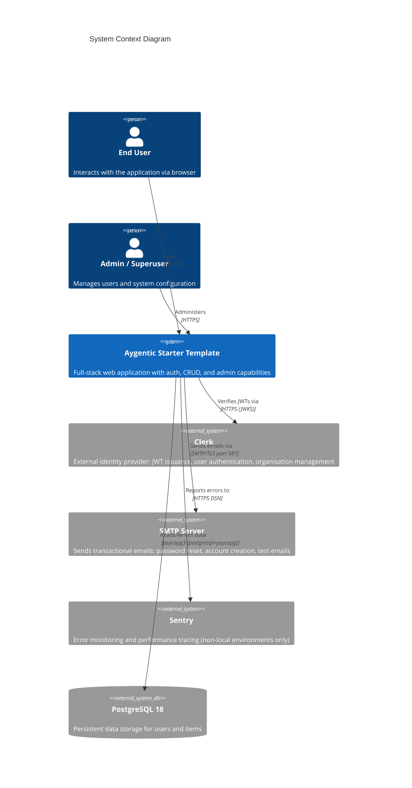
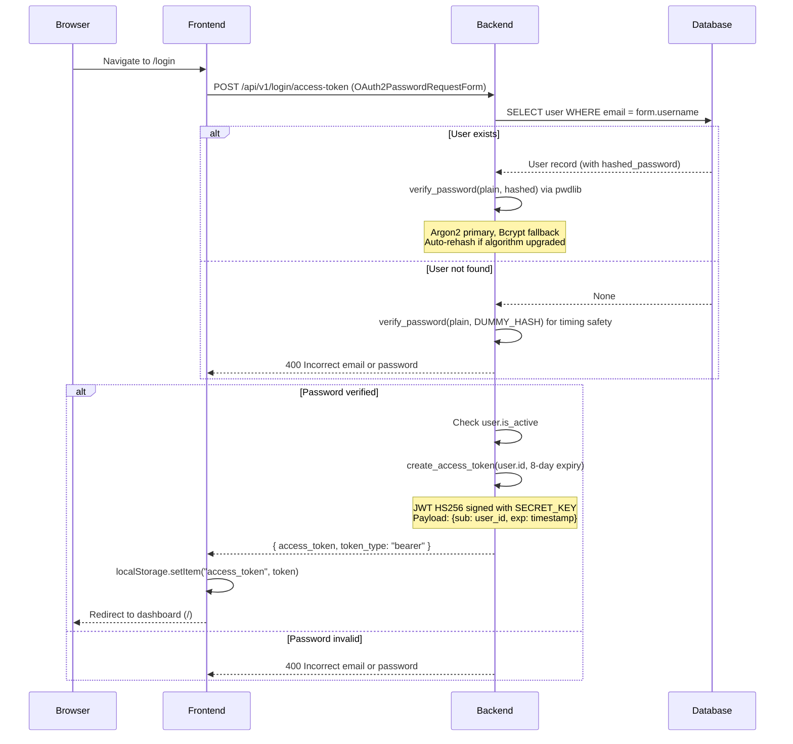
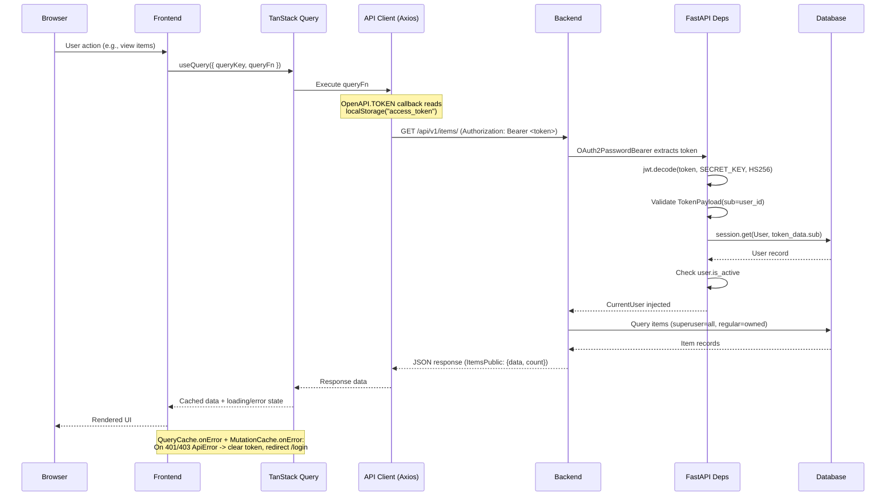
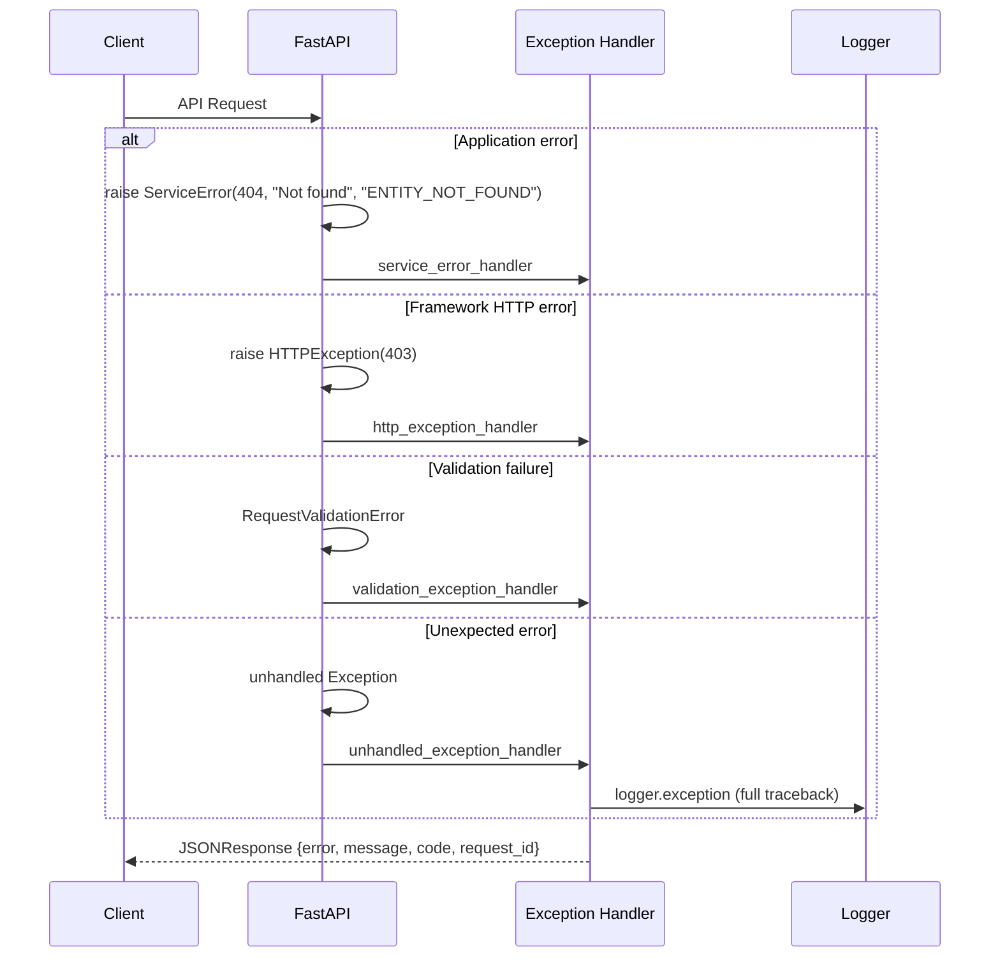

# Architecture Overview

## Purpose

The Aygentic Starter Template is a full-stack monorepo providing a production-ready foundation for building web applications. It combines a Python/FastAPI REST API backend with a React/TypeScript single-page application frontend, backed by PostgreSQL, and deployed via Docker Compose with Traefik as a reverse proxy. The system delivers JWT-based authentication (transitioning to Clerk as the external identity provider), user management with role-based access control, CRUD operations for domain entities, a unified error handling framework that guarantees consistent JSON error responses across all endpoints, and an auto-generated type-safe API client that bridges backend and frontend.

## System Context



## Key Components

| Component | Purpose | Technology | Location |
|-----------|---------|------------|----------|
| FastAPI Backend | REST API server (titled via `SERVICE_NAME` setting) handling auth, CRUD, and business logic; registers unified error handlers at startup; initializes structured logging at startup via `setup_logging(settings)` and registers `RequestPipelineMiddleware` as the outermost middleware | Python 3.10+, FastAPI >=0.114.2, Pydantic 2.x | `backend/app/main.py` |
| API Router | Mounts versioned route modules under `/api/v1` | FastAPI APIRouter | `backend/app/api/main.py` |
| Auth & Dependencies | JWT token validation, DB session injection, role-based guards; transitioning from internal HS256 JWT to Clerk JWT with `Principal` identity model (`user_id`, `roles`, `org_id`) | PyJWT, OAuth2PasswordBearer, Annotated Depends | `backend/app/api/deps.py` |
| Security Module | Password hashing (Argon2 primary + Bcrypt fallback) and JWT token creation (legacy; being replaced by Clerk external auth) | pwdlib (Argon2Hasher, BcryptHasher), PyJWT (HS256) | `backend/app/core/security.py` |
| Error Handling | Unified exception handler framework; `ServiceError` exception, `STATUS_CODE_MAP`, 4 global handlers registered at startup via `register_exception_handlers(app)` | FastAPI exception handlers, Pydantic response models | `backend/app/core/errors.py` |
| Structured Logging | Configures structlog with JSON (production/CI) or console (local) renderer; injects service metadata (service, version, environment) and request-scoped fields (request_id, correlation_id) via contextvars into every log entry | structlog >=24.1.0 | `backend/app/core/logging.py` |
| Request Pipeline Middleware | Outermost middleware: generates UUID v4 request_id, propagates X-Correlation-ID (with validation), binds both to structlog contextvars, sets five security headers on all responses, applies HSTS in production only, logs each request at status-appropriate level (2xx=info, 4xx=warning, 5xx=error), always sets X-Request-ID response header | Starlette BaseHTTPMiddleware | `backend/app/core/middleware.py` |
| Configuration | Environment-based settings with validation and secret enforcement | pydantic-settings, `.env` file, computed fields | `backend/app/core/config.py` |
| Database Engine | SQLAlchemy engine creation and initial superuser seeding | SQLModel, psycopg3 (postgresql+psycopg) | `backend/app/core/db.py` |
| Shared Models (Package) | Pure Pydantic response envelopes (`ErrorResponse`, `ValidationErrorResponse`, `PaginatedResponse[T]`) and auth identity model (`Principal`) | Pydantic 2.x | `backend/app/models/` |
| Domain Models (Legacy) | SQLModel ORM tables + Pydantic request/response schemas (being migrated into models package) | SQLModel (User, Item + variant schemas) | `backend/app/models.py` |
| CRUD Utilities | Data access functions with timing-attack-safe authentication | SQLModel Session, Argon2 dummy hash comparison | `backend/app/crud.py` |
| Database Migrations | Schema version control and migration management | Alembic | `backend/app/alembic/` |
| Login Routes | OAuth2 token login, token test, password recovery/reset | FastAPI router | `backend/app/api/routes/login.py` |
| Users Routes | User CRUD, self-registration (`/signup`), profile management | FastAPI router | `backend/app/api/routes/users.py` |
| Items Routes | Item CRUD with ownership enforcement (superusers see all) | FastAPI router | `backend/app/api/routes/items.py` |
| Utils Routes | Health check endpoint, test email sending (superuser only) | FastAPI router | `backend/app/api/routes/utils.py` |
| Private Routes | Local-only user creation (gated by `ENVIRONMENT=local`) | FastAPI router | `backend/app/api/routes/private.py` |
| React Frontend | Single-page application with authenticated dashboard UI | React 19.1, TypeScript 5.9, Vite 7.3 (SWC) | `frontend/src/main.tsx` |
| Frontend Router | File-based routing with layout guards and code splitting | TanStack Router 1.157+ | `frontend/src/routes/` |
| Server State Management | API data fetching, caching, and global 401/403 error handling | TanStack Query 5.90+ (QueryCache, MutationCache) | `frontend/src/main.tsx` |
| Auto-generated API Client | Type-safe HTTP client generated from OpenAPI schema | @hey-api/openapi-ts, Axios 1.13 | `frontend/src/client/` |
| UI Component Library | Styled component system with dark theme support | Tailwind CSS 4.2, shadcn/ui (new-york variant) | `frontend/src/components/` |
| Reverse Proxy (Production) | TLS termination via Let's Encrypt, host-based routing, HTTPS redirect | Traefik 3.6 | `compose.yml` (labels) |
| Reverse Proxy (Local Dev) | HTTP-only proxy with insecure dashboard, no TLS | Traefik 3.6 | `compose.override.yml` |
| Database Admin | Web-based database inspection tool (pepa-linha-dark theme) | Adminer | `compose.yml` |
| Mail Catcher (Dev) | Local SMTP trap for development email testing | schickling/mailcatcher (ports 1025/1080) | `compose.override.yml` |
| Prestart Service | Waits for DB, runs Alembic migrations, seeds initial superuser | Bash, Alembic, Python | `backend/scripts/prestart.sh` |
| Playwright Runner | Containerised E2E test execution against backend | Playwright, Docker | `compose.override.yml` |

## Data Flow

### Authentication Flow



### Authenticated API Request Flow



## Deployment Architecture

### Docker Compose Services

The application runs as a set of Docker Compose services with two configuration layers:

**Production** (`compose.yml`):
- `db` -- PostgreSQL 18 with health check, persistent volume (`app-db-data`), env-based credentials
- `prestart` -- Runs `scripts/prestart.sh` (wait for DB, `alembic upgrade head`, seed superuser), exits on completion
- `backend` -- FastAPI server on port 8000, depends on healthy `db` + completed `prestart`, health check at `/api/v1/utils/health-check/`
- `frontend` -- Nginx-served SPA on port 80, built with `VITE_API_URL=https://api.${DOMAIN}`
- `adminer` -- Database admin UI on port 8080
- Traefik labels route `api.${DOMAIN}` to backend, `dashboard.${DOMAIN}` to frontend, `adminer.${DOMAIN}` to Adminer, all with HTTPS (Let's Encrypt `certresolver=le`)

**Local Development** (`compose.override.yml` extends `compose.yml`):
- `proxy` -- Traefik 3.6 with insecure dashboard (port 8090), no TLS, HTTP-only entrypoints
- `backend` -- Hot-reload via `fastapi run --reload`, `docker compose watch` for file sync, port 8000 exposed
- `frontend` -- Built with `VITE_API_URL=http://localhost:8000`, port 5173 exposed
- `mailcatcher` -- Local SMTP trap (SMTP port 1025, web UI port 1080) for email testing
- `playwright` -- Containerised E2E test runner with blob-report volume mount
- `traefik-public` network set to `external: false` for local operation

### Networking

```
Browser --> :80/:443 (Traefik)
               |
        Host-based routing:
               |
    api.${DOMAIN} --> backend:8000
    dashboard.${DOMAIN} --> frontend:80
    adminer.${DOMAIN} --> adminer:8080
               |
    backend --> db:5432 (internal network)
```

## Model Architecture

### Models Package (`backend/app/models/`)

The models directory is now a Python package with two categories of pure Pydantic types, re-exported via `__init__.py` for flat imports (`from app.models import ErrorResponse, Principal`):

**`backend/app/models/common.py`** -- Shared API response envelopes:
- `ErrorResponse` -- Standard error envelope (`error`, `message`, `code`, `request_id`)
- `ValidationErrorDetail` -- Single field-level validation failure (`field`, `message`, `type`)
- `ValidationErrorResponse` -- Extends `ErrorResponse` with `details: list[ValidationErrorDetail]`
- `PaginatedResponse[T]` -- Generic paginated list envelope (`data: list[T]`, `count: int`)

**`backend/app/models/auth.py`** -- Authentication identity:
- `Principal` -- Authenticated user principal extracted from a verified Clerk JWT. Fields: `user_id` (str, Clerk user ID), `roles` (list[str], default []), `org_id` (str | None, Clerk organisation ID)

### Domain Models (Legacy, `backend/app/models.py`)

The original domain models follow a layered schema pattern using SQLModel and are being incrementally migrated into the models package (AYG-65 through AYG-74):

```
ModelBase (shared validated fields)
  |-- ModelCreate (input for creation, includes password)
  |-- ModelUpdate (partial input for updates, all optional)
  |-- Model(table=True) (ORM table with id, hashed_password, created_at, relationships)
  |-- ModelPublic (API response shape with id, no password)
  |-- ModelsPublic (paginated list response: {data: [], count: int})
```

**Entities:**
- **User** -- `id` (UUID), `email` (unique, indexed), `hashed_password`, `is_active`, `is_superuser`, `full_name`, `created_at` (UTC). Has cascade-delete relationship to Items.
- **Item** -- `id` (UUID), `title`, `description`, `created_at` (UTC), `owner_id` (FK to User with CASCADE delete).

**Additional schemas:** `UserRegister` (public signup), `UserUpdateMe` (self-service profile), `UpdatePassword` (current + new password), `Token` / `TokenPayload` (JWT), `NewPassword` (reset flow), `Message` (generic response).

## Error Handling

All API errors are routed through a unified exception handling framework (`backend/app/core/errors.py`) that guarantees every error response conforms to a standard JSON envelope.

### Standard Error Response Shape

```json
{
  "error": "NOT_FOUND",
  "message": "Entity not found",
  "code": "ENTITY_NOT_FOUND",
  "request_id": "550e8400-e29b-41d4-a716-446655440000"
}
```

For validation errors (HTTP 422), the response extends with field-level details:

```json
{
  "error": "VALIDATION_ERROR",
  "message": "Request validation failed.",
  "code": "VALIDATION_FAILED",
  "request_id": "...",
  "details": [
    { "field": "title", "message": "Field required", "type": "missing" }
  ]
}
```

### Components

- **`ServiceError` exception** -- Application-level error with structured fields: `status_code` (int), `message` (str), `code` (str, machine-readable UPPER_SNAKE_CASE), and `error` (auto-resolved from `STATUS_CODE_MAP`)
- **`STATUS_CODE_MAP`** -- Maps HTTP status codes (400, 401, 403, 404, 409, 422, 429, 500, 503) to UPPER_SNAKE_CASE error category strings
- **4 global exception handlers**, registered at app startup via `register_exception_handlers(app)`:
  1. `service_error_handler` -- Catches `ServiceError`, formats with the standard envelope
  2. `http_exception_handler` -- Catches FastAPI/Starlette `HTTPException`, maps to standard envelope
  3. `validation_exception_handler` -- Catches `RequestValidationError`, produces per-field `details` array with dot-notation field paths
  4. `unhandled_exception_handler` -- Catch-all for `Exception`; logs full traceback via `logger.exception`, returns generic "An unexpected error occurred." to clients

### Error Flow



### Response Models

The error response Pydantic models live in `backend/app/models/common.py`:

| Model | Fields | Usage |
|-------|--------|-------|
| `ErrorResponse` | `error`, `message`, `code`, `request_id` | Standard error envelope for all non-validation errors |
| `ValidationErrorDetail` | `field`, `message`, `type` | Single field-level validation failure |
| `ValidationErrorResponse` | Extends `ErrorResponse` + `details: list[ValidationErrorDetail]` | HTTP 422 validation errors |

## Request Pipeline

### Middleware Stack

`RequestPipelineMiddleware` is registered as the **outermost** ASGI middleware by being added last via `app.add_middleware()`. In Starlette, last-added = outermost, which means it wraps `CORSMiddleware`. This ensures security headers and `X-Request-ID` are set on **all** responses, including CORS preflight OPTIONS responses that CORSMiddleware short-circuits before reaching route handlers.

```
Request
  └── RequestPipelineMiddleware (outermost)
        └── CORSMiddleware
              └── FastAPI / Route Handlers
```

### Request Lifecycle (per request)

1. Generate `request_id` (UUID v4)
2. Read `X-Correlation-ID` header; validate against `^[a-zA-Z0-9\-_.]{1,128}$`; fall back to `request_id` if absent or invalid
3. Store `request_id` and `correlation_id` in `request.state`
4. Bind both to structlog contextvars (automatically present in all log lines)
5. Process request via `call_next`; catch unhandled exceptions → log + return 500 JSON
6. Calculate `duration_ms`
7. Apply security headers
8. Set `X-Request-ID` response header
9. Log `request_completed` at status-appropriate level
10. Clear contextvars

### Security Headers

| Header | Value | Condition |
|--------|-------|-----------|
| X-Content-Type-Options | nosniff | All responses |
| X-Frame-Options | DENY | All responses |
| X-XSS-Protection | 0 (disabled, CSP preferred) | All responses |
| Referrer-Policy | strict-origin-when-cross-origin | All responses |
| Permissions-Policy | camera=(), microphone=(), geolocation=() | All responses |
| Strict-Transport-Security | max-age=31536000; includeSubDomains | Production only |

### Structured Logging

`setup_logging(settings)` is called once at module load in `main.py` before app creation.

**Processor chain (in order):**
1. `merge_contextvars` -- merges request-scoped fields bound by middleware
2. `add_log_level` -- adds `level` field
3. `TimeStamper(fmt="iso")` -- adds ISO 8601 `timestamp` field
4. `_add_service_info` -- injects `service`, `version`, `environment` via `setdefault`
5. `StackInfoRenderer` -- renders stack info if present
6. `format_exc_info` -- formats exception info
7. `UnicodeDecoder` -- decodes bytes to strings
8. Renderer: `JSONRenderer` (LOG_FORMAT=json) or `ConsoleRenderer` (LOG_FORMAT=console)

**Request log fields** (event: `request_completed`):
- Always: `timestamp`, `level`, `event`, `service`, `version`, `environment`, `request_id`, `correlation_id`, `method`, `path`, `status_code`, `duration_ms`
- Optional: `user_id` (when `request.state.user_id` is set by auth)

**Log levels by status:**
- 2xx → `info`
- 4xx → `warning`
- 5xx → `error`

## Security Architecture

### Password Hashing
- **Primary hasher:** Argon2id via `pwdlib.hashers.argon2.Argon2Hasher`
- **Fallback hasher:** Bcrypt via `pwdlib.hashers.bcrypt.BcryptHasher`
- **Auto-upgrade:** `verify_and_update()` returns a new hash if the stored hash uses an outdated algorithm, enabling transparent migration from Bcrypt to Argon2
- **Timing-attack prevention:** When a login attempt targets a non-existent email, `crud.authenticate()` still runs `verify_password()` against a precomputed `DUMMY_HASH` to ensure constant response time

### JWT Tokens (Transitioning to Clerk)

**Current (legacy):**
- **Algorithm:** HS256 (symmetric, signed with `SECRET_KEY`)
- **Payload:** `{"sub": "<user_uuid>", "exp": <utc_timestamp>}`
- **Expiry:** 8 days (configurable via `ACCESS_TOKEN_EXPIRE_MINUTES`, default 11520)
- **Validation:** `jwt.decode()` in `get_current_user` dependency, followed by DB lookup and `is_active` check
- **Storage:** Frontend stores token in `localStorage`, attached via `OpenAPI.TOKEN` callback on every Axios request

**Target (Clerk external auth):**
- Authentication will be delegated to Clerk as the external identity provider
- JWTs are issued and signed by Clerk, verified by the backend using Clerk's public keys
- The `Principal` model (`backend/app/models/auth.py`) represents the authenticated caller: `user_id` (Clerk user ID), `roles` (list of granted roles), `org_id` (Clerk organisation, optional)
- Internal password hashing and token creation will be removed once the Clerk migration is complete

### Secret Enforcement
- `Settings._check_default_secret()` raises `ValueError` in staging/production if `SECRET_KEY`, `POSTGRES_PASSWORD`, or `FIRST_SUPERUSER_PASSWORD` are left as `"changethis"`
- In local environment, the same check emits a warning instead

### CORS
- `BACKEND_CORS_ORIGINS` parsed from comma-separated string or JSON array
- `FRONTEND_HOST` is always appended to allowed origins
- Middleware configured with `allow_credentials=True`, wildcard methods and headers

### Role-Based Access
- **Regular users:** Can manage own profile, own items, self-register via `/signup`
- **Superusers:** Full CRUD on all users and items, access to test-email endpoint, password recovery HTML preview
- Guard implemented as `get_current_active_superuser` dependency (raises 403 if `user.is_superuser` is False)

## Frontend Architecture

### Routing Structure (TanStack Router, file-based)

```
frontend/src/routes/
  __root.tsx          -- Root layout (wraps all routes)
  login.tsx           -- /login (public)
  signup.tsx          -- /signup (public)
  recover-password.tsx -- /recover-password (public)
  reset-password.tsx  -- /reset-password (public)
  _layout.tsx         -- Authenticated layout wrapper (auth guard)
  _layout/
    index.tsx         -- / (dashboard, requires auth)
    items.tsx         -- /items (items CRUD, requires auth)
    settings.tsx      -- /settings (user profile, requires auth)
    admin.tsx         -- /admin (user management, requires auth + superuser)
```

### State Management
- **Server state:** TanStack Query with global `QueryClient` configured with `QueryCache` and `MutationCache` error handlers that intercept 401/403 `ApiError` responses to clear the token and redirect to `/login`
- **Auth state:** `access_token` in `localStorage`, read via `OpenAPI.TOKEN` async callback
- **Theme:** `ThemeProvider` with dark mode default, persisted to `localStorage` under key `vite-ui-theme`
- **Notifications:** Sonner toast library with `richColors` and `closeButton` enabled

### API Client Generation
- Generated from the backend's OpenAPI schema at `/api/v1/openapi.json` using `@hey-api/openapi-ts`
- Output written to `frontend/src/client/` (auto-generated, must not be manually edited)
- Transport layer: Axios 1.13
- Regeneration: `bash ./scripts/generate-client.sh` (also triggered by pre-commit hook on backend changes)

## Architecture Decisions

Key decisions are documented as ADRs in `docs/architecture/decisions/`:

| ADR | Title | Status | Date |
|-----|-------|--------|------|
| [0001](decisions/0001-unified-error-handling-framework.md) | Unified Error Handling Framework | proposed | 2026-02-27 |
| [0002](decisions/0002-shared-pydantic-models-package.md) | Shared Pydantic Models Package | proposed | 2026-02-27 |
| [0003](decisions/0003-structlog-and-request-pipeline-middleware.md) | Structlog Adoption and Request Pipeline Middleware | accepted | 2026-02-27 |

## Known Constraints

1. **Single-database architecture** -- The system uses a single PostgreSQL 18 instance for all data. This simplifies operations but limits read/write scaling to vertical scaling unless read replicas are introduced.

2. **Stateless JWT with no revocation** -- Access tokens (8-day expiry) cannot be individually revoked once issued. The only mechanism for invalidation is changing the `SECRET_KEY`, which invalidates all tokens simultaneously. Per-session revocation would require a token blacklist or a switch to shorter-lived tokens with refresh tokens.

3. **localStorage token storage** -- JWT tokens are stored in `localStorage`, which is accessible to any JavaScript running on the same origin. This trades security (compared to httpOnly cookies) for simplicity in the SPA architecture. XSS vulnerabilities would expose tokens.

4. **Monorepo coupling** -- Backend and frontend share a single repository and Docker Compose deployment. While this simplifies development coordination, it means both must be deployed together and share the same release cadence.

5. **Auto-generated API client (build-time dependency)** -- The frontend API client is generated from the backend's OpenAPI schema via `@hey-api/openapi-ts`. Any backend API change requires regenerating the client (`scripts/generate-client.sh`) to maintain type safety. The pre-commit hook automates this, but it creates a build-time coupling.

6. **Environment-gated private routes** -- The `private` API router (unrestricted user creation) is only mounted when `ENVIRONMENT=local`. This is a configuration-based guard rather than an infrastructure-based one. Misconfigured environments could expose this endpoint.

7. **Default secrets in local development** -- `SECRET_KEY`, `POSTGRES_PASSWORD`, and `FIRST_SUPERUSER_PASSWORD` default to `"changethis"`. The `Settings` validator warns in local mode but raises `ValueError` in staging/production, preventing deployment with default credentials.

8. **Conditional integration test fixtures** -- `backend/tests/conftest.py` guards integration-level fixtures (DB session, test client, auth token helpers) behind a `try/except` import block (`_INTEGRATION_DEPS_AVAILABLE`). This allows unit tests in `backend/tests/unit/` to run in isolation without a database or the full app context. The guard is temporary while integration fixtures are being migrated (AYG-65 through AYG-74).

9. **Auth in transition (legacy + Clerk)** -- The codebase currently contains both legacy internal HS256 JWT authentication (`backend/app/core/security.py`, `backend/app/api/deps.py`) and the new Clerk-oriented `Principal` model (`backend/app/models/auth.py`). Both coexist during the migration; the legacy auth path will be removed once Clerk integration is complete.

10. **Middleware ordering sensitivity** -- `RequestPipelineMiddleware` must remain the last `add_middleware()` call in `main.py` to stay outermost. Adding new middleware after it will wrap it, causing security headers and X-Request-ID to be absent on responses short-circuited by the new middleware.

## Related Documents

- [API Documentation](../api/overview.md)
- [Data Models](../data/models.md)
- [Deployment Guide](../deployment/environments.md)
- [Testing Strategy](../testing/strategy.md)
