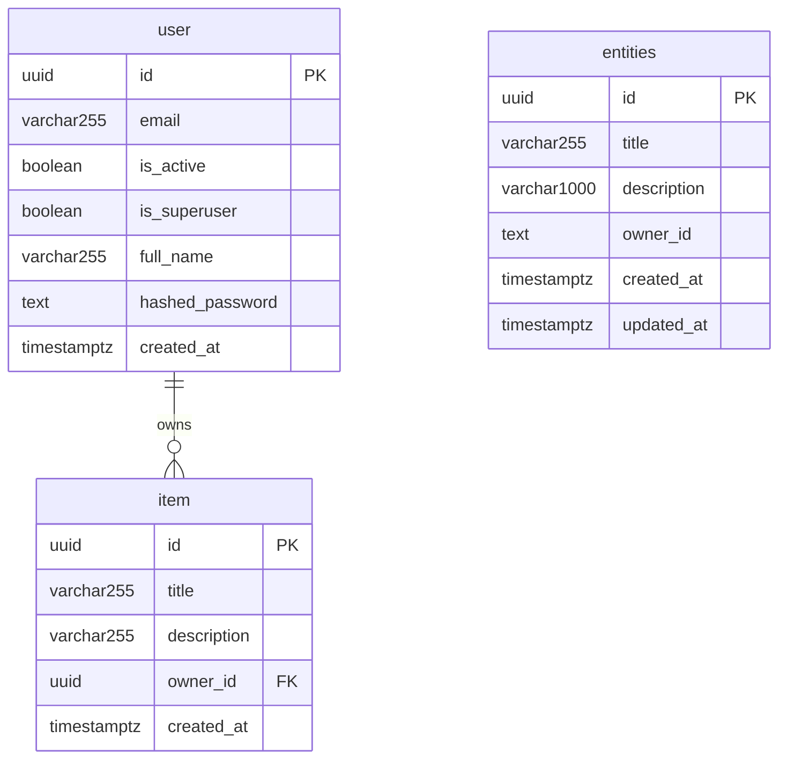

# Data Models

## Overview

This project uses two persistence backends: PostgreSQL 18 (via Docker) accessed through SQLModel (SQLAlchemy-backed ORM) with a psycopg3 binary driver for the `user` and `item` tables; and Supabase (PostgreSQL) for the `entities` table, accessed via the Supabase REST client with Row-Level Security. The `public` schema contains three tables — `user`, `item`, and `entities` — modelling a multi-user application where authenticated users own and manage their own resources. SQLModel schema evolution is managed by Alembic migrations in `backend/app/alembic/versions/`; the `entities` table is managed by Supabase CLI migrations in `supabase/migrations/`.

**Database:** PostgreSQL 18
**Schema:** public
**ORM:** SQLModel >= 0.0.21 (SQLAlchemy under the hood)
**Driver:** psycopg3 (binary)
**Migrations:** Alembic >= 1.12.1

---

## Entity Relationship Diagram



> Note: `entities` is stored in Supabase (PostgreSQL) and is not related to the `user` table via a database-level foreign key. `owner_id` holds a Clerk user ID (text) and tenant isolation is enforced at the database level by Row-Level Security policies, not by an FK constraint.

---

## Tables

### user

```sql
CREATE TABLE "user" (
    id              UUID            NOT NULL PRIMARY KEY,
    email           VARCHAR(255)    NOT NULL,
    is_active       BOOLEAN         NOT NULL DEFAULT TRUE,
    is_superuser    BOOLEAN         NOT NULL DEFAULT FALSE,
    full_name       VARCHAR(255)    NULL,
    hashed_password VARCHAR         NOT NULL,
    created_at      TIMESTAMPTZ     NULL
);

CREATE UNIQUE INDEX ix_user_email ON "user" (email);
```

**Columns:**

| Column | Type | Nullable | Default | Description |
|--------|------|----------|---------|-------------|
| id | UUID | No | uuid4() (application) | Primary key, generated by Python `uuid.uuid4()` |
| email | VARCHAR(255) | No | — | Unique email address used for authentication |
| is_active | BOOLEAN | No | TRUE | Whether the account is active; inactive users cannot log in |
| is_superuser | BOOLEAN | No | FALSE | Grants superuser privileges when TRUE |
| full_name | VARCHAR(255) | Yes | NULL | Optional display name |
| hashed_password | VARCHAR | No | — | Argon2id hash of the user's password (with Bcrypt fallback) |
| created_at | TIMESTAMPTZ | Yes | now() (application) | UTC timestamp set at record creation |

**Business Rules:**

1. Passwords supplied via API must be between 8 and 128 characters; the raw password is never stored — only its Argon2id hash (with Bcrypt as a secondary hasher for legacy verification).
2. Email must be unique across all users (enforced by both the `ix_user_email` unique index and the `EmailStr` Pydantic validator on the `email` field).
3. On authentication, if a user is not found the system still runs password verification against a dummy Argon2id hash to prevent timing-based user-enumeration attacks (`crud.authenticate` / `DUMMY_HASH`).
4. If `verify_password` returns an updated hash (e.g., when the stored hash is a legacy Bcrypt hash), the new hash is immediately persisted to the database (`crud.authenticate` re-saves `hashed_password`).
5. A first superuser is seeded on `init_db` if no user with the configured `FIRST_SUPERUSER` email exists; this record has `is_superuser=True`.
6. Deleting a user cascades to all owned items (see Relationships section).

**Constraints:**

| Name | Type | Definition |
|------|------|------------|
| user_pkey | PRIMARY KEY | (id) |
| ix_user_email | UNIQUE INDEX | (email) |

**Indexes:**

| Name | Columns | Type | Purpose |
|------|---------|------|---------|
| user_pkey | id | btree (unique) | Primary key lookup |
| ix_user_email | email | btree (unique) | Fast login lookup and uniqueness enforcement |

---

### item

```sql
CREATE TABLE item (
    id          UUID            NOT NULL PRIMARY KEY,
    title       VARCHAR(255)    NOT NULL,
    description VARCHAR(255)    NULL,
    owner_id    UUID            NOT NULL,
    created_at  TIMESTAMPTZ     NULL,
    CONSTRAINT item_owner_id_fkey
        FOREIGN KEY (owner_id) REFERENCES "user"(id) ON DELETE CASCADE
);
```

**Columns:**

| Column | Type | Nullable | Default | Description |
|--------|------|----------|---------|-------------|
| id | UUID | No | uuid4() (application) | Primary key, generated by Python `uuid.uuid4()` |
| title | VARCHAR(255) | No | — | Item title; minimum 1 character, maximum 255 characters |
| description | VARCHAR(255) | Yes | NULL | Optional free-text description; maximum 255 characters |
| owner_id | UUID | No | — | Foreign key referencing `user.id`; set at creation, never changed |
| created_at | TIMESTAMPTZ | Yes | now() (application) | UTC timestamp set at record creation |

**Business Rules:**

1. `title` must be at least 1 character long and at most 255 characters; enforced by Pydantic validators on `ItemBase` and `ItemUpdate`.
2. `owner_id` is set by the application at creation time from the authenticated user's identity; it is not accepted from API input directly (`crud.create_item` injects `owner_id` via `model_validate(..., update={"owner_id": owner_id})`).
3. When a user is deleted, all items belonging to that user are automatically deleted via `ON DELETE CASCADE` on the foreign key constraint.
4. Items belong to exactly one owner; there is no shared ownership or transfer mechanism in the current schema.

**Constraints:**

| Name | Type | Definition |
|------|------|------------|
| item_pkey | PRIMARY KEY | (id) |
| item_owner_id_fkey | FOREIGN KEY | (owner_id) REFERENCES user(id) ON DELETE CASCADE |

**Indexes:**

| Name | Columns | Type | Purpose |
|------|---------|------|---------|
| item_pkey | id | btree (unique) | Primary key lookup |

---

### entities

> Managed by Supabase CLI (not Alembic). Accessed via the Supabase REST client. Row-Level Security is enabled; the service role key bypasses RLS for admin operations.

```sql
-- supabase/migrations/20260227000000_create_entities.sql

CREATE EXTENSION IF NOT EXISTS "pgcrypto";

CREATE TABLE entities (
    id          UUID            PRIMARY KEY DEFAULT gen_random_uuid(),
    title       VARCHAR(255)    NOT NULL,
    description VARCHAR(1000),
    owner_id    TEXT            NOT NULL,
    created_at  TIMESTAMPTZ     NOT NULL DEFAULT now(),
    updated_at  TIMESTAMPTZ     NOT NULL DEFAULT now()
);

CREATE INDEX idx_entities_owner_id ON entities(owner_id);

CREATE OR REPLACE FUNCTION update_updated_at()
RETURNS TRIGGER AS $$
BEGIN
    NEW.updated_at = now();
    RETURN NEW;
END;
$$ LANGUAGE plpgsql;

CREATE TRIGGER entities_updated_at
    BEFORE UPDATE ON entities
    FOR EACH ROW
    EXECUTE FUNCTION update_updated_at();

ALTER TABLE entities ENABLE ROW LEVEL SECURITY;

CREATE POLICY "Users can view own entities"
    ON entities FOR SELECT
    USING (owner_id = current_setting('request.jwt.claim.sub', true));

CREATE POLICY "Users can insert own entities"
    ON entities FOR INSERT
    WITH CHECK (owner_id = current_setting('request.jwt.claim.sub', true));

CREATE POLICY "Users can update own entities"
    ON entities FOR UPDATE
    USING (owner_id = current_setting('request.jwt.claim.sub', true))
    WITH CHECK (owner_id = current_setting('request.jwt.claim.sub', true));

CREATE POLICY "Users can delete own entities"
    ON entities FOR DELETE
    USING (owner_id = current_setting('request.jwt.claim.sub', true));
```

**Columns:**

| Column | Type | Nullable | Default | Description |
|--------|------|----------|---------|-------------|
| id | UUID | No | gen_random_uuid() | Primary key, generated by the database |
| title | VARCHAR(255) | No | — | Human-readable entity title; 1–255 characters |
| description | VARCHAR(1000) | Yes | NULL | Optional freeform description; maximum 1000 characters |
| owner_id | TEXT | No | — | Clerk user ID of the owning user; set at creation, never changed by a normal update |
| created_at | TIMESTAMPTZ | No | now() | UTC timestamp set at row insertion |
| updated_at | TIMESTAMPTZ | No | now() | UTC timestamp updated automatically by the `entities_updated_at` trigger on every UPDATE |

**Business Rules:**

1. `owner_id` is injected by the service layer from the authenticated caller's Clerk JWT `sub` claim; it is never accepted from API request bodies (`entity_service.create_entity` injects `owner_id` as a function argument).
2. All queries in `entity_service.py` filter by `owner_id` explicitly (`.eq("owner_id", owner_id)`) in addition to RLS, providing defence-in-depth for tenant isolation.
3. RLS policies on `entities` use `current_setting('request.jwt.claim.sub', true)` to resolve the caller identity from the Supabase JWT context; the anon and authenticated Supabase roles are subject to these policies.
4. Operations using the Supabase service role key bypass RLS entirely — this key must be restricted to trusted server-side contexts only.
5. `updated_at` is maintained exclusively by the `entities_updated_at` database trigger; application code must not set this column manually.
6. `list_entities` caps page size at 100 records (`_MAX_LIMIT = 100`) regardless of the `limit` argument supplied by the caller.
7. `update_entity` with an empty payload (no fields set) performs a no-op by fetching and returning the current entity without issuing an UPDATE statement.

**Constraints:**

| Name | Type | Definition |
|------|------|------------|
| entities_pkey | PRIMARY KEY | (id) |
| "Users can view own entities" | RLS POLICY (SELECT) | `owner_id = current_setting('request.jwt.claim.sub', true)` |
| "Users can insert own entities" | RLS POLICY (INSERT WITH CHECK) | `owner_id = current_setting('request.jwt.claim.sub', true)` |
| "Users can update own entities" | RLS POLICY (UPDATE) | USING and WITH CHECK: `owner_id = current_setting('request.jwt.claim.sub', true)` |
| "Users can delete own entities" | RLS POLICY (DELETE) | `owner_id = current_setting('request.jwt.claim.sub', true)` |

**Indexes:**

| Name | Columns | Type | Purpose |
|------|---------|------|---------|
| entities_pkey | id | btree (unique) | Primary key lookup |
| idx_entities_owner_id | owner_id | btree | Fast owner-scoped list and lookup queries |

---

## Relationships

| Table | Column | References | On Delete |
|-------|--------|------------|-----------|
| item | owner_id | user.id | CASCADE |

The `user` -> `item` relationship is one-to-many: one user owns zero or more items. The SQLModel relationship is defined with `cascade_delete=True` on `User.items` (ORM-level) and `ondelete="CASCADE"` on `Item.owner_id` (database-level), providing double-layered cascade protection.

---

## Schema Variants (Pydantic / API Layer)

SQLModel uses a layered schema pattern. These classes are not database tables but define the shapes used for API request/response validation:

| Class | Purpose |
|-------|---------|
| `UserBase` | Shared fields: email, is_active, is_superuser, full_name |
| `UserCreate` | API creation payload — adds `password` |
| `UserRegister` | Self-registration payload — email, password, full_name |
| `UserUpdate` | API update payload — all fields optional including password |
| `UserUpdateMe` | Authenticated user self-update — full_name and email only |
| `UpdatePassword` | Password change — current_password + new_password |
| `User` | Database table model (`table=True`) |
| `UserPublic` | API response — id, email, is_active, is_superuser, full_name, created_at |
| `UsersPublic` | Paginated list response — data[] + count |
| `ItemBase` | Shared fields: title, description |
| `ItemCreate` | API creation payload — inherits ItemBase |
| `ItemUpdate` | API update payload — title optional |
| `Item` | Database table model (`table=True`) |
| `ItemPublic` | API response — id, title, description, owner_id, created_at |
| `ItemsPublic` | Paginated list response — data[] + count |
| `EntityBase` | Shared fields: title (required, 1–255 chars), description (optional, max 1000 chars) |
| `EntityCreate` | API creation payload — inherits EntityBase; title required, description optional |
| `EntityUpdate` | API partial-update payload — does NOT inherit EntityBase; both fields optional for true PATCH semantics |
| `EntityPublic` | API response — id (UUID), title, description, owner_id (Clerk user ID), created_at, updated_at |
| `EntitiesPublic` | Paginated collection response — data[] of EntityPublic + total count |

### Entity Schema Family (`backend/app/models/entity.py`)

Entity models are **pure Pydantic `BaseModel` (NOT SQLModel)**. There is no ORM table mapping; persistence is handled entirely via the Supabase REST client (`supabase-py`). The inheritance chain is:

```
EntityBase
├── EntityCreate      (inherits EntityBase — title required)
└── EntityPublic      (inherits EntityBase — adds id, owner_id, created_at, updated_at)

EntityUpdate          (standalone BaseModel — all fields optional for PATCH semantics)

EntitiesPublic        (standalone BaseModel — wraps list[EntityPublic] + count)
```

`EntityUpdate` deliberately does NOT inherit `EntityBase` so that every field is independently optional, enabling true partial-update (PATCH) semantics where only supplied fields are written to the database.

---

### Additional Utility Schemas

| Class | Purpose |
|-------|---------|
| `Message` | Generic API response — single `message: str` field |
| `Token` | JWT access token response — access_token + token_type ("bearer") |
| `TokenPayload` | JWT payload representation — sub: str or None |
| `NewPassword` | Password reset via token — token + new_password (8-128 chars) |

---

## Shared Pydantic Models

These models live in `backend/app/models/` and are **pure Pydantic types — not database tables**. They have no corresponding migrations, no ORM mapping, and no SQL representation. They define standard contracts for auth identity and API response envelopes shared across all routes.

### Principal (`backend/app/models/auth.py`)

Represents the authenticated caller extracted from a validated Clerk JWT. Used as a FastAPI dependency injection type in route handlers — the JWT verification middleware resolves this object and injects it directly into endpoint function signatures.

```python
class Principal(BaseModel):
    user_id: str
    session_id: str
    roles: list[str] = []
    org_id: str | None = None
```

**Fields:**

| Field | Type | Required | Default | Description |
|-------|------|----------|---------|-------------|
| user_id | str | Yes | — | Clerk user ID (e.g. `user_2abc...`) extracted from the JWT `sub` claim |
| session_id | str | Yes | — | Clerk session ID extracted from the JWT `sid` claim |
| roles | list[str] | No | `[]` | List of role names granted to this user |
| org_id | str \| None | No | `None` | Clerk organisation ID, or `None` when the user has no active organisation |

**Business Rules:**

1. `user_id` is always present — it is the primary identity key for all authorization decisions in route handlers.
2. `session_id` is always present — it is the Clerk session ID from the JWT `sid` claim, used for session-level identification and revocation checks.
3. `roles` defaults to an empty list; routes requiring a specific role must check membership explicitly.
4. `org_id` is `None` for users operating outside an organisation context; multi-tenant routes must treat `None` as the personal workspace.
5. `Principal` is never instantiated from user-supplied input; it is constructed only by the JWT verification dependency.

---

### ErrorResponse (`backend/app/models/common.py`)

Standard error envelope returned for all API error responses (4xx and 5xx). Every error handler in `backend/app/core/errors.py` serializes to this shape, ensuring a consistent contract for API consumers.

```python
class ErrorResponse(BaseModel):
    error: str
    message: str
    code: str
    request_id: str
```

**Fields:**

| Field | Type | Required | Default | Description |
|-------|------|----------|---------|-------------|
| error | str | Yes | — | HTTP status category in UPPER_SNAKE_CASE (e.g. `NOT_FOUND`, `INTERNAL_ERROR`) |
| message | str | Yes | — | Human-readable error description suitable for display |
| code | str | Yes | — | Machine-readable UPPER_SNAKE_CASE error code for programmatic handling |
| request_id | str | Yes | — | UUID of the originating request for log correlation |

**Business Rules:**

1. `error` is derived from `STATUS_CODE_MAP` in `errors.py` — it reflects the HTTP status category, not the application-specific code.
2. `code` is more granular than `error`; for example `error="NOT_FOUND"` and `code="ENTITY_NOT_FOUND"` can coexist.
3. `request_id` must be a valid UUID string; it is generated per-request by the exception handler, not the caller.
4. `message` is intended for human consumption; API clients should branch on `code`, not `message`.

---

### ValidationErrorDetail (`backend/app/models/common.py`)

Represents a single field-level validation failure. Used as elements within the `details` list of `ValidationErrorResponse`. Field paths use dot notation for nested fields.

```python
class ValidationErrorDetail(BaseModel):
    field: str
    message: str
    type: str
```

**Fields:**

| Field | Type | Required | Default | Description |
|-------|------|----------|---------|-------------|
| field | str | Yes | — | Field path using dot notation for nested fields (e.g. `address.street`) |
| message | str | Yes | — | Human-readable validation message for this specific field |
| type | str | Yes | — | Error type identifier (e.g. `missing`, `string_type`, `value_error`) |

**Business Rules:**

1. `field` uses the raw field name without request-location prefixes — it must not start with `body.`, `query.`, or `path.`.
2. `type` values correspond to Pydantic v2 error type identifiers.

---

### ValidationErrorResponse (`backend/app/models/common.py`)

Extends `ErrorResponse` with a `details` list of per-field `ValidationErrorDetail` objects. Returned with HTTP 422 from the request validation exception handler.

```python
class ValidationErrorResponse(ErrorResponse):
    details: list[ValidationErrorDetail]
```

**Fields:**

Inherits all four fields from `ErrorResponse` (`error`, `message`, `code`, `request_id`) plus:

| Field | Type | Required | Default | Description |
|-------|------|----------|---------|-------------|
| details | list[ValidationErrorDetail] | Yes | — | List of individual field validation errors; may be empty for non-field errors |

**Business Rules:**

1. `error` is always `"VALIDATION_ERROR"` and `code` is always `"VALIDATION_FAILED"` for request-body validation failures handled by the FastAPI `RequestValidationError` handler.
2. `details` may be an empty list in edge cases where Pydantic provides no field-level breakdown.
3. This type is a strict superset of `ErrorResponse` — any consumer that handles `ErrorResponse` handles `ValidationErrorResponse` as well.

---

### PaginatedResponse[T] (`backend/app/models/common.py`)

Generic paginated list envelope for all list endpoints. The type parameter `T` is the item schema. `count` reflects the total across all pages, not just the current page.

```python
class PaginatedResponse(BaseModel, Generic[T]):
    data: list[T]
    count: int
```

**Fields:**

| Field | Type | Required | Default | Description |
|-------|------|----------|---------|-------------|
| data | list[T] | Yes | — | Page of items; may be an empty list when no results match |
| count | int | Yes | — | Total number of items across all pages (for pagination controls) |

**Business Rules:**

1. `count` represents the total result set size, not `len(data)` — callers must not assume `count == len(data)`.
2. `data` may be an empty list when `count` is zero or when the requested page offset exceeds the total.
3. Usage: `PaginatedResponse[UserPublic](data=users, count=total)` — the type parameter is passed at instantiation, not class definition.

---

## Migration History

### Alembic Migrations (SQLModel — `user` and `item` tables)

Migrations are located in `backend/app/alembic/versions/`. The chain is linear (no branches).

| Revision ID | Date | Description | Reversible | Chain |
|-------------|------|-------------|------------|-------|
| `e2412789c190` | 2023-11-24 | Initialize models — creates `user` and `item` tables with integer PKs and base columns | Yes | Initial |
| `9c0a54914c78` | 2024-06-17 | Add max length VARCHAR constraints — sets VARCHAR(255) on email, full_name, title, description | Yes | e2412789c190 |
| `d98dd8ec85a3` | 2024-07-19 | Replace integer IDs with UUIDs — migrates PK and FK columns on both tables using `uuid-ossp` extension | Yes | 9c0a54914c78 |
| `1a31ce608336` | 2024-07-31 | Add cascade delete — makes `item.owner_id` NOT NULL and adds `ON DELETE CASCADE` to the FK constraint | Yes | d98dd8ec85a3 |
| `fe56fa70289e` | 2026-01-23 | Add `created_at` timestamps — adds nullable `TIMESTAMPTZ` column to both `user` and `item` | Yes | 1a31ce608336 |

### Supabase CLI Migrations (`entities` table)

Migrations are located in `supabase/migrations/`. Applied via `supabase db push` or `supabase migration up`. **These are NOT managed by Alembic** — they are plain SQL files applied by the Supabase CLI.

| File | Date | Description | Reversible |
|------|------|-------------|------------|
| `20260227000000_create_entities.sql` | 2026-02-27 | Create `entities` table with UUID PK, owner index, `updated_at` trigger, RLS enabled, and 4 RLS policies (SELECT/INSERT/UPDATE/DELETE all scoped to JWT `sub` claim) | Manual (no down migration) |

---

## Alembic Commands Reference

All commands are run from the `backend/` directory (where `alembic.ini` lives). The migration scripts directory is `app/alembic/` as configured in `alembic.ini` (`script_location = app/alembic`).

```bash
# Apply all pending migrations (upgrade to head)
alembic upgrade head

# Roll back one migration
alembic downgrade -1

# Roll back to a specific revision
alembic downgrade <revision_id>

# Show current revision applied to the database
alembic current

# Show pending migrations relative to head
alembic history --verbose

# Auto-generate a new migration from model changes
alembic revision --autogenerate -m "describe the change"

# Show the SQL that would be executed (dry run)
alembic upgrade head --sql
```

## Supabase CLI Commands Reference

The `entities` table and its RLS policies are managed by Supabase CLI migrations in `supabase/migrations/`. These commands are run from the project root.

```bash
# Apply all pending Supabase migrations to the linked project
supabase db push

# Apply pending migrations in a local Supabase dev environment
supabase migration up

# Create a new timestamped migration file
supabase migration new <migration_name>

# List applied migrations
supabase migration list

# Reset the local database and re-apply all migrations
supabase db reset
```
