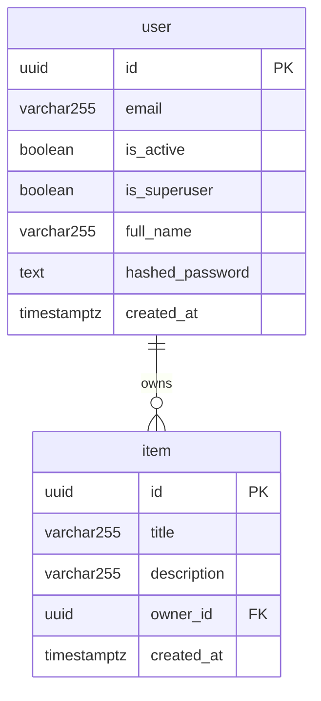

# Data Models

## Overview

This project uses PostgreSQL 18 (via Docker) as its primary database, accessed through SQLModel (SQLAlchemy-backed ORM) with a psycopg3 binary driver. The `public` schema contains two tables — `user` and `item` — that together model a multi-user application where authenticated users own and manage their own items. Schema evolution is managed by Alembic migrations located in `backend/app/alembic/versions/`.

**Database:** PostgreSQL 18
**Schema:** public
**ORM:** SQLModel >= 0.0.21 (SQLAlchemy under the hood)
**Driver:** psycopg3 (binary)
**Migrations:** Alembic >= 1.12.1

---

## Entity Relationship Diagram



---

## Tables

### user

```sql
CREATE TABLE "user" (
    id              UUID            NOT NULL PRIMARY KEY,
    email           VARCHAR(255)    NOT NULL,
    is_active       BOOLEAN         NOT NULL DEFAULT TRUE,
    is_superuser    BOOLEAN         NOT NULL DEFAULT FALSE,
    full_name       VARCHAR(255)    NULL,
    hashed_password VARCHAR         NOT NULL,
    created_at      TIMESTAMPTZ     NULL
);

CREATE UNIQUE INDEX ix_user_email ON "user" (email);
```

**Columns:**

| Column | Type | Nullable | Default | Description |
|--------|------|----------|---------|-------------|
| id | UUID | No | uuid4() (application) | Primary key, generated by Python `uuid.uuid4()` |
| email | VARCHAR(255) | No | — | Unique email address used for authentication |
| is_active | BOOLEAN | No | TRUE | Whether the account is active; inactive users cannot log in |
| is_superuser | BOOLEAN | No | FALSE | Grants superuser privileges when TRUE |
| full_name | VARCHAR(255) | Yes | NULL | Optional display name |
| hashed_password | VARCHAR | No | — | Argon2id hash of the user's password (with Bcrypt fallback) |
| created_at | TIMESTAMPTZ | Yes | now() (application) | UTC timestamp set at record creation |

**Business Rules:**

1. Passwords supplied via API must be between 8 and 128 characters; the raw password is never stored — only its Argon2id hash (with Bcrypt as a secondary hasher for legacy verification).
2. Email must be unique across all users (enforced by both the `ix_user_email` unique index and the `EmailStr` Pydantic validator on the `email` field).
3. On authentication, if a user is not found the system still runs password verification against a dummy Argon2id hash to prevent timing-based user-enumeration attacks (`crud.authenticate` / `DUMMY_HASH`).
4. If `verify_password` returns an updated hash (e.g., when the stored hash is a legacy Bcrypt hash), the new hash is immediately persisted to the database (`crud.authenticate` re-saves `hashed_password`).
5. A first superuser is seeded on `init_db` if no user with the configured `FIRST_SUPERUSER` email exists; this record has `is_superuser=True`.
6. Deleting a user cascades to all owned items (see Relationships section).

**Constraints:**

| Name | Type | Definition |
|------|------|------------|
| user_pkey | PRIMARY KEY | (id) |
| ix_user_email | UNIQUE INDEX | (email) |

**Indexes:**

| Name | Columns | Type | Purpose |
|------|---------|------|---------|
| user_pkey | id | btree (unique) | Primary key lookup |
| ix_user_email | email | btree (unique) | Fast login lookup and uniqueness enforcement |

---

### item

```sql
CREATE TABLE item (
    id          UUID            NOT NULL PRIMARY KEY,
    title       VARCHAR(255)    NOT NULL,
    description VARCHAR(255)    NULL,
    owner_id    UUID            NOT NULL,
    created_at  TIMESTAMPTZ     NULL,
    CONSTRAINT item_owner_id_fkey
        FOREIGN KEY (owner_id) REFERENCES "user"(id) ON DELETE CASCADE
);
```

**Columns:**

| Column | Type | Nullable | Default | Description |
|--------|------|----------|---------|-------------|
| id | UUID | No | uuid4() (application) | Primary key, generated by Python `uuid.uuid4()` |
| title | VARCHAR(255) | No | — | Item title; minimum 1 character, maximum 255 characters |
| description | VARCHAR(255) | Yes | NULL | Optional free-text description; maximum 255 characters |
| owner_id | UUID | No | — | Foreign key referencing `user.id`; set at creation, never changed |
| created_at | TIMESTAMPTZ | Yes | now() (application) | UTC timestamp set at record creation |

**Business Rules:**

1. `title` must be at least 1 character long and at most 255 characters; enforced by Pydantic validators on `ItemBase` and `ItemUpdate`.
2. `owner_id` is set by the application at creation time from the authenticated user's identity; it is not accepted from API input directly (`crud.create_item` injects `owner_id` via `model_validate(..., update={"owner_id": owner_id})`).
3. When a user is deleted, all items belonging to that user are automatically deleted via `ON DELETE CASCADE` on the foreign key constraint.
4. Items belong to exactly one owner; there is no shared ownership or transfer mechanism in the current schema.

**Constraints:**

| Name | Type | Definition |
|------|------|------------|
| item_pkey | PRIMARY KEY | (id) |
| item_owner_id_fkey | FOREIGN KEY | (owner_id) REFERENCES user(id) ON DELETE CASCADE |

**Indexes:**

| Name | Columns | Type | Purpose |
|------|---------|------|---------|
| item_pkey | id | btree (unique) | Primary key lookup |

---

## Relationships

| Table | Column | References | On Delete |
|-------|--------|------------|-----------|
| item | owner_id | user.id | CASCADE |

The `user` -> `item` relationship is one-to-many: one user owns zero or more items. The SQLModel relationship is defined with `cascade_delete=True` on `User.items` (ORM-level) and `ondelete="CASCADE"` on `Item.owner_id` (database-level), providing double-layered cascade protection.

---

## Schema Variants (Pydantic / API Layer)

SQLModel uses a layered schema pattern. These classes are not database tables but define the shapes used for API request/response validation:

| Class | Purpose |
|-------|---------|
| `UserBase` | Shared fields: email, is_active, is_superuser, full_name |
| `UserCreate` | API creation payload — adds `password` |
| `UserRegister` | Self-registration payload — email, password, full_name |
| `UserUpdate` | API update payload — all fields optional including password |
| `UserUpdateMe` | Authenticated user self-update — full_name and email only |
| `UpdatePassword` | Password change — current_password + new_password |
| `User` | Database table model (`table=True`) |
| `UserPublic` | API response — id, email, is_active, is_superuser, full_name, created_at |
| `UsersPublic` | Paginated list response — data[] + count |
| `ItemBase` | Shared fields: title, description |
| `ItemCreate` | API creation payload — inherits ItemBase |
| `ItemUpdate` | API update payload — title optional |
| `Item` | Database table model (`table=True`) |
| `ItemPublic` | API response — id, title, description, owner_id, created_at |
| `ItemsPublic` | Paginated list response — data[] + count |

### Additional Utility Schemas

| Class | Purpose |
|-------|---------|
| `Message` | Generic API response — single `message: str` field |
| `Token` | JWT access token response — access_token + token_type ("bearer") |
| `TokenPayload` | JWT payload representation — sub: str or None |
| `NewPassword` | Password reset via token — token + new_password (8-128 chars) |

---

## Migration History

Migrations are located in `backend/app/alembic/versions/`. The chain is linear (no branches).

| Revision ID | Date | Description | Reversible | Chain |
|-------------|------|-------------|------------|-------|
| `e2412789c190` | 2023-11-24 | Initialize models — creates `user` and `item` tables with integer PKs and base columns | Yes | Initial |
| `9c0a54914c78` | 2024-06-17 | Add max length VARCHAR constraints — sets VARCHAR(255) on email, full_name, title, description | Yes | e2412789c190 |
| `d98dd8ec85a3` | 2024-07-19 | Replace integer IDs with UUIDs — migrates PK and FK columns on both tables using `uuid-ossp` extension | Yes | 9c0a54914c78 |
| `1a31ce608336` | 2024-07-31 | Add cascade delete — makes `item.owner_id` NOT NULL and adds `ON DELETE CASCADE` to the FK constraint | Yes | d98dd8ec85a3 |
| `fe56fa70289e` | 2026-01-23 | Add `created_at` timestamps — adds nullable `TIMESTAMPTZ` column to both `user` and `item` | Yes | 1a31ce608336 |

---

## Alembic Commands Reference

All commands are run from the `backend/` directory (where `alembic.ini` lives). The migration scripts directory is `app/alembic/` as configured in `alembic.ini` (`script_location = app/alembic`).

```bash
# Apply all pending migrations (upgrade to head)
alembic upgrade head

# Roll back one migration
alembic downgrade -1

# Roll back to a specific revision
alembic downgrade <revision_id>

# Show current revision applied to the database
alembic current

# Show pending migrations relative to head
alembic history --verbose

# Auto-generate a new migration from model changes
alembic revision --autogenerate -m "describe the change"

# Show the SQL that would be executed (dry run)
alembic upgrade head --sql
```
