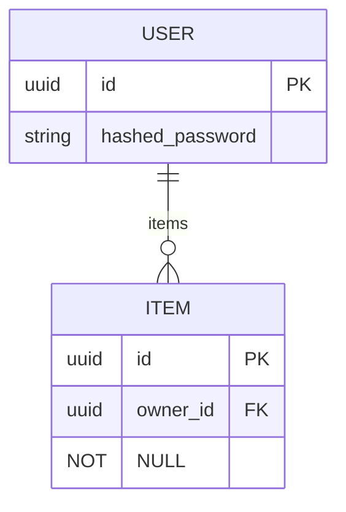

# Database Entity Relationship Diagram (ERD)

This document contains the automatically generated Entity Relationship Diagram for the FastAPI Template database schema. The ERD is generated from SQLModel definitions and updated automatically via git pre-commit hooks.

## Overview

The ERD below shows the current database schema with all tables, fields, relationships, and constraints. This diagram is automatically maintained and reflects the actual SQLModel definitions in the codebase.

## Generated ERD



## Schema Details

### Tables

#### USER
- **Purpose**: Stores user account information
- **Primary Key**: `id` (UUID)
- **Fields**:
  - `id`: Primary key (UUID, auto-generated)
  - `hashed_password`: User's hashed password (string)

#### ITEM
- **Purpose**: Stores user-owned items
- **Primary Key**: `id` (UUID)
- **Foreign Keys**: 
  - `owner_id` → `USER.id`
- **Fields**:
  - `id`: Primary key (UUID, auto-generated)
  - `owner_id`: Foreign key to USER table (UUID, required)

### Relationships

#### USER → ITEM (One-to-Many)
- **Type**: One-to-Many
- **Description**: A user can own multiple items
- **Implementation**: Foreign key `owner_id` in ITEM table
- **Cascade**: Not specified (default behavior)

## How This ERD is Maintained

### Automatic Updates
This ERD diagram is automatically updated whenever:
- SQLModel definitions are modified in `backend/app/models.py`
- New models are added or removed
- Relationships between models change
- Field definitions are updated

### Update Mechanism
The ERD is updated via a git pre-commit hook that:
1. Detects changes to SQLModel files
2. Regenerates the ERD from current model definitions
3. Updates this documentation file
4. Validates the generated ERD syntax

### Manual Generation
You can manually regenerate the ERD using:

```bash
# Generate ERD from current models
python -m backend.scripts.generate_erd

# Generate with validation
python -m backend.scripts.generate_erd --validate --verbose

# Generate to custom location
python -m backend.scripts.generate_erd --output-path custom/erd.mmd
```

## Validation

The ERD generation process includes validation to ensure:
- All SQLModel classes with `table=True` are included
- Primary keys are properly defined
- Foreign key relationships are valid
- Generated Mermaid syntax is correct
- All entities have at least one field

### Validation Checks
- **Model Validation**: Ensures all models have required fields and valid relationships
- **Syntax Validation**: Validates generated Mermaid ERD syntax
- **Relationship Validation**: Ensures all relationships reference valid entities
- **Constraint Validation**: Verifies database constraints are properly represented

## Performance

The ERD generation system is designed to handle:
- **Small schemas** (< 5 tables): < 1 second
- **Medium schemas** (5-10 tables): < 5 seconds  
- **Large schemas** (10-20 tables): < 30 seconds
- **Very large schemas** (20+ tables): Scales linearly

## Troubleshooting

### Common Issues

#### ERD Not Updating
- **Cause**: Pre-commit hook not installed or not running
- **Solution**: Run `pre-commit install` and ensure hooks are enabled

#### Invalid ERD Syntax
- **Cause**: Malformed SQLModel definitions or relationship issues
- **Solution**: Run `python -m backend.scripts.generate_erd --validate` to identify issues

#### Missing Tables
- **Cause**: SQLModel class missing `table=True` parameter
- **Solution**: Ensure all database models have `table=True` in their class definition

#### Relationship Issues
- **Cause**: Incorrect `back_populates` or foreign key definitions
- **Solution**: Verify relationship definitions match between related models

### Getting Help

If you encounter issues with the ERD generation:

1. **Check validation output**:
   ```bash
   python -m backend.scripts.generate_erd --validate --verbose
   ```

2. **Review model definitions** in `backend/app/models.py`

3. **Check pre-commit hook status**:
   ```bash
   pre-commit run erd-generation --verbose
   ```

4. **Regenerate from scratch**:
   ```bash
   rm docs/database/erd.mmd
   python -m backend.scripts.generate_erd
   ```

## Technical Details

### Generation Process
1. **Model Discovery**: Scan for SQLModel classes in specified paths
2. **Metadata Extraction**: Parse SQLModel definitions to extract schema information
3. **Relationship Analysis**: Detect and analyze relationships between models
4. **ERD Generation**: Create Mermaid ERD syntax from extracted metadata
5. **Validation**: Validate generated ERD for syntax and semantic correctness
6. **Output**: Write ERD to documentation file

### Bidirectional Relationship Handling
The ERD generator intelligently handles bidirectional relationships by:
- Detecting relationships with `back_populates` parameters
- Showing only the one-to-many direction to reduce visual clutter
- Displaying foreign key fields to indicate reverse relationships
- Avoiding redundant relationship lines

### File Formats
- **Input**: SQLModel Python classes in `backend/app/models.py`
- **Output**: Mermaid ERD syntax in `docs/database/erd.mmd`
- **Documentation**: Markdown with embedded Mermaid in `docs/database/erd.md`

## Integration

This ERD system integrates with:
- **Git Workflow**: Automatic updates via pre-commit hooks
- **Documentation**: Part of project documentation standards
- **CI/CD**: Can be included in build and deployment pipelines
- **Development**: Provides real-time schema visualization

## Related Documentation

- [Database Models](../backend/app/models.py) - SQLModel definitions
- [ERD Generator](../backend/app/erd_generator.py) - Generation logic
- [Quickstart Guide](../../specs/001-as-a-first/quickstart.md) - Usage instructions
- [Project Constitution](../../.specify/memory/constitution.md) - Documentation standards

---

*This documentation is automatically maintained. Do not edit manually - changes will be overwritten.*
