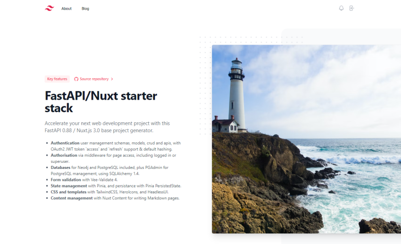
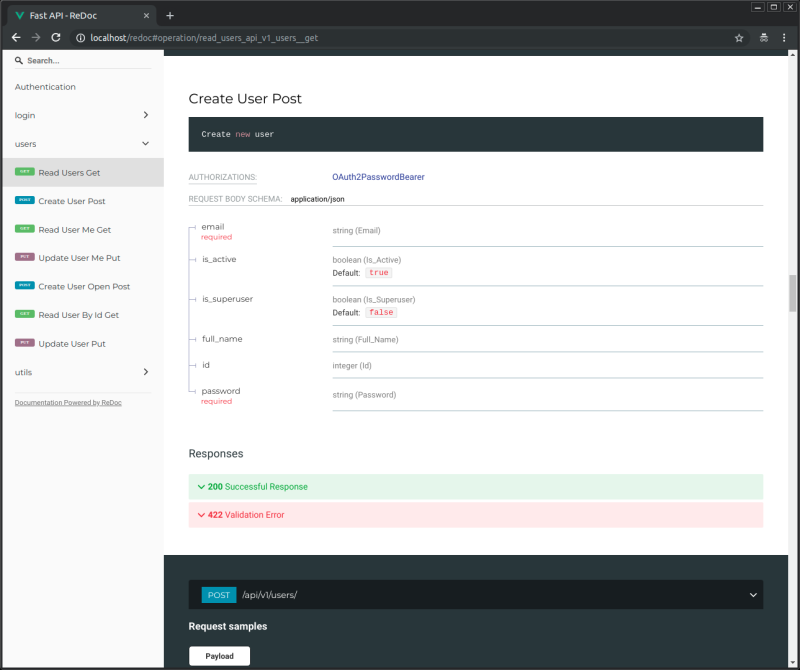

# Getting started with the Base Project Generator

1. [Getting started](getting-started.md)
2. [Development and installation](development-guide.md)
3. [Deployment for production](deployment-guide.md)
4. [Authentication and magic tokens](authentication-guide.md)

---

## Contents

- [What is it?](#what-is-it)
- [Who is it for?](#who-is-it-for)
- [What does it look like?](#what-does-it-look-like)
- [How to use it](#how-to-use-it)
- [Release notes](#release-notes)
- [License](#license)

## What is it?

This FastAPI, PostgreSQL, Neo4j & Nuxt 3 repo will generate a complete web application stack as a foundation for your project development.

It consists of the following key components:

- **Docker Compose** integration and optimization for local development.
- **Authentication** user management schemas, models, crud and apis already built, with OAuth2 JWT token support & default hashing. Offers _magic link_ authentication, with password fallback, with cookie management, including `access` and `refresh` tokens.
- [**FastAPI**](https://github.com/tiangolo/fastapi) backend with [Inboard](https://inboard.bws.bio/) one-repo Docker images:
  - **SQLAlchemy** version 2.0 support for models.
  - **MJML** templates for common email transactions.
  - **Metadata Schema** based on [Dublin Core](https://www.dublincore.org/specifications/dublin-core/dcmi-terms/#section-3) for inheritance.
  - **Common CRUD** support via generic inheritance.
  - **Standards-based**: Based on (and fully compatible with) the open standards for APIs: [OpenAPI](https://github.com/OAI/OpenAPI-Specification) and [JSON Schema](http://json-schema.org/).
  - [**Many other features**]("https://fastapi.tiangolo.com/features/"): including automatic validation, serialization, interactive documentation, etc.
- [**Nuxt/Vue 3**](https://nuxt.com/) frontend:
  - **Authorisation** via middleware for page access, including logged in or superuser.
  - **Model blog** project, with [Nuxt Content](https://content.nuxtjs.org/) for writing Markdown pages.
  - **Form validation** with [Vee-Validate 4](https://vee-validate.logaretm.com/v4/).
  - **State management** with [Pinia](https://pinia.vuejs.org/), and persistance with [Pinia PersistedState](https://prazdevs.github.io/pinia-plugin-persistedstate/).
  - **CSS and templates** with [TailwindCSS](https://tailwindcss.com/), [HeroIcons](https://heroicons.com/), and [HeadlessUI](https://headlessui.com/).
- **PostgreSQL** database.
- **PGAdmin** for PostgreSQL database management.
- **Celery** worker that can import and use models and code from the rest of the backend selectively.
- **Flower** for Celery jobs monitoring.
- **Neo4j** graph database, including integration into the FastAPI base project.
- Load balancing between frontend and backend with **Traefik**, so you can have both under the same domain, separated by path, but served by different containers.
- Traefik integration, including Let's Encrypt **HTTPS** certificates automatic generation.
- GitLab **CI** (continuous integration), including frontend and backend testing.

## Who is it for?

This project is a rock-solid foundation on which to build complex web applications which need parallel processing, scheduled event management, and a range of relational and graph database support. The base deployment - with PostgreSQL and Neo4j - takes up about 10Gb, and requires about 2Gb of memory to run. 

This is **not** a light-weight system to deploy a blog or simple content-management-system.

It is for developers looking to build and maintain full feature progressive web applications that can run online, or offline, want the complex-but-routine aspects of auth 'n auth, and component and deployment configuration taken care of. 

## What does it look like?

### App landing page

### Dashboard Login

### Dashboard User Management

### Interactive API documentation

### Enabling two-factor security (TOTP)

## How to use it

### Installing for local development

Running Cookiecutter to customise the deployment with your settings, and then building with Docker compose, takes about 20 minutes.

- [Development and installation](development-guide.md)

### Deploying for production

This stack can be adjusted and used with several deployment options that are compatible with Docker Compose, but it is designed to be used in a cluster controlled with pure Docker in Swarm Mode with a Traefik main load balancer proxy handling automatic HTTPS certificates, using the ideas from [DockerSwarm.rocks](https://dockerswarm.rocks).

- [Deployment for production](deployment-guide.md)

### Authentication with magic and TOTP

Time-based One-Time Password (TOTP) authentication extends the login process to include a challenge-response component where the user needs to enter a time-based token after their preferred login method.

- [Authentication and magic tokens](authentication-guide.md)

### More details

After using this generator, your new project will contain an extensive `README.md` with instructions for development, deployment, etc. You can pre-read [the project `README.md` template here too](../{{cookiecutter.project_slug}}/README.md).

## Release Notes

See notes and [releases](https://github.com/whythawk/full-stack-fastapi-postgresql/releases). The last four release notes are listed here:

### 0.7.3
- @nuxt/content 2.2.1 -> 2.4.3
- Fixed: `@nuxt/content` default api, `/api/_content`, conflicts with the `backend` api url preventing content pages loading.
- Documentation: Complete deployment guide in `DEPLOYMENT-README.md` (this has now been moved to `/docs`)

### 0.7.2
- Fixed: URLs for recreating project in generated `README.md`. PR [#15](https://github.com/whythawk/full-stack-fastapi-postgresql/pull/15) by @FranzForstmayr
- Fixed: Absolute path for mount point in `docker-compose.override.yml`. PR [#16](https://github.com/whythawk/full-stack-fastapi-postgresql/pull/16) by @FranzForstmayr
- Fixed: Login artifacts left over from before switch to magic auth. PR [#18](https://github.com/whythawk/full-stack-fastapi-postgresql/pull/18) by @turukawa and @FranzForstmayr
- New: New floating magic login card. PR [#19](https://github.com/whythawk/full-stack-fastapi-postgresql/pull/19) by @turukawa
- New: New site contact page. PR [#20](https://github.com/whythawk/full-stack-fastapi-postgresql/pull/20) by @turukawa

### 0.7.1

- SQLAlchemy 1.4 -> 2.0
- Nuxt.js 3.0 -> 3.2.2
- Fixed: `tokenUrl` in `app/api/deps.py`. Thanks to @Choiuijin1125.
- Fixed: SMTP options for TLS must be `ssl`. Thanks to @raouldo.
- Fixed: `libgeos` is a dependency for `shapely` which is a dependency for `neomodel`, and which doesn't appear to be installed correctly on Macs. Thanks to @valsha and @Mocha-L.
- Fixed: `frontend` fails to start in development. Thanks to @pabloapast and @dividor.

### 0.7.0

- New feature: magic (email-based) login, with password fallback
- New feature: Time-based One-Time Password (TOTP) authentication
- Security enhancements to improve consistency, safety and reliability of the authentication process (see full description in the frontend app)
- Requires one new `frontend` dependency: [QRcode.vue](https://github.com/scopewu/qrcode.vue)

[Historic changes from original](https://github.com/tiangolo/full-stack-fastapi-postgresql#release-notes)

## License

This project is licensed under the terms of the MIT license.
