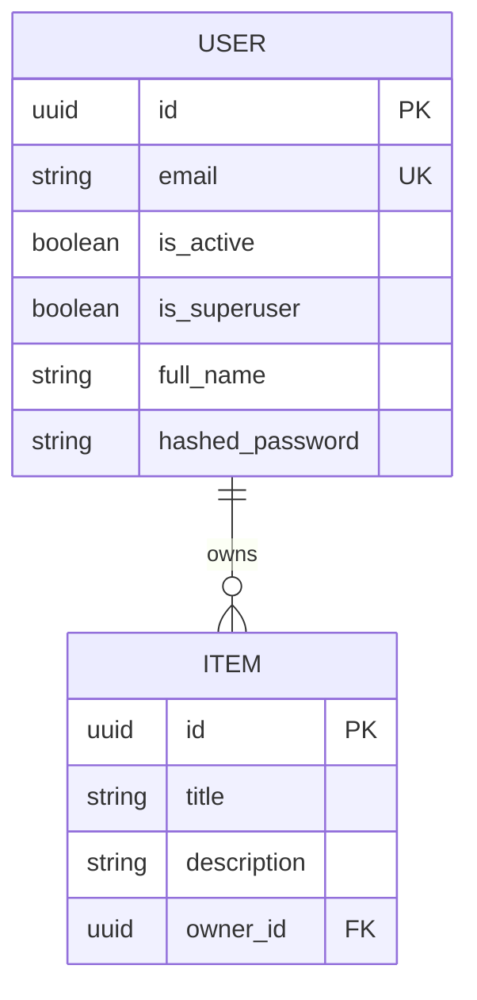

# Quickstart: Mermaid ERD Diagram Documentation

## Overview
This quickstart guide demonstrates how to use the ERD generation system to create and maintain Mermaid Entity Relationship Diagrams for the FastAPI Template project.

## Prerequisites
- Python 3.11+ environment
- FastAPI Template project with SQLModel definitions
- Pre-commit framework installed (for automatic updates)

## Basic Usage

### 1. Generate ERD Diagram
```bash
# Generate ERD from current models
python -m backend.scripts.generate_erd

# Generate with custom paths
python -m backend.scripts.generate_erd --models-path backend/app/models.py --output-path docs/database/erd.md

# Generate with validation
python -m backend.scripts.generate_erd --validate --verbose
```

### 2. View Generated ERD
The ERD diagram will be generated at `docs/database/erd.md` and can be viewed in any Markdown renderer that supports Mermaid diagrams.

### 3. Validate ERD Accuracy
```bash
# Validate existing ERD against current models
python -m backend.scripts.generate_erd --validate

# Validate with detailed report
python -m backend.scripts.generate_erd --validate --verbose
```

## Automatic Updates

### Pre-commit Hook Setup
The ERD diagram will be automatically updated when you commit changes to SQLModel definitions:

```bash
# Install pre-commit hooks (if not already done)
pre-commit install

# Test the hook
pre-commit run erd-generation

# Commit changes (hook runs automatically)
git add backend/app/models.py
git commit -m "Add new User model"
```

### Manual Hook Execution
```bash
# Run ERD generation hook manually
pre-commit run erd-generation

# Run all hooks including ERD generation
pre-commit run --all-files
```

## Workflow Examples

### Adding a New Model
1. **Create SQLModel class** in `backend/app/models.py`:
   ```python
   class Product(SQLModel, table=True):
       id: uuid.UUID = Field(default_factory=uuid.uuid4, primary_key=True)
       name: str = Field(max_length=255)
       price: decimal.Decimal = Field(max_digits=10, decimal_places=2)
       category_id: uuid.UUID = Field(foreign_key="category.id")
       category: Category | None = Relationship(back_populates="products")
   ```

2. **Commit changes** (ERD updates automatically):
   ```bash
   git add backend/app/models.py
   git commit -m "Add Product model"
   ```

3. **Verify ERD update**:
   ```bash
   # Check if ERD was updated
   git diff HEAD~1 docs/database/erd.md
   
   # Validate ERD accuracy
   python -m backend.scripts.generate_erd --validate
   ```

### Modifying Existing Model
1. **Update SQLModel definition** in `backend/app/models.py`
2. **Commit changes** (ERD updates automatically)
3. **Validate changes** with `--validate` flag

### Troubleshooting
```bash
# Check ERD generation status
python -m backend.scripts.generate_erd --verbose

# Validate ERD syntax
python -m backend.scripts.generate_erd --validate

# Regenerate ERD from scratch
rm docs/database/erd.md
python -m backend.scripts.generate_erd
```

## Expected Output

### Generated ERD Structure
The generated ERD will include:
- All SQLModel classes with `table=True`
- Field definitions with types and constraints
- Relationship lines showing foreign keys
- Cardinality indicators (1:1, 1:N, N:M)
- Primary key indicators

### Example ERD Output


## Integration with Development Workflow

### Constitution Compliance
- ERD generation follows Full-Stack Integration principle
- Documentation updates follow Documentation Standards
- Pre-commit hooks follow Code Quality Standards
- Error handling follows Security by Default principle

### Template Updates
- Constitution updated with ERD documentation requirements
- Plan template includes ERD generation checks
- Task template includes ERD maintenance tasks

## Support and Troubleshooting

### Common Issues
- **Parse Errors**: Check SQLModel syntax and imports
- **Validation Failures**: Verify model definitions and relationships
- **Hook Failures**: Check pre-commit configuration and permissions
- **Generation Errors**: Validate Python environment and dependencies

### Getting Help
- Check validation output for specific error messages
- Review ERD generation logs with `--verbose` flag
- Verify pre-commit hook configuration
- Consult project documentation for model definitions
