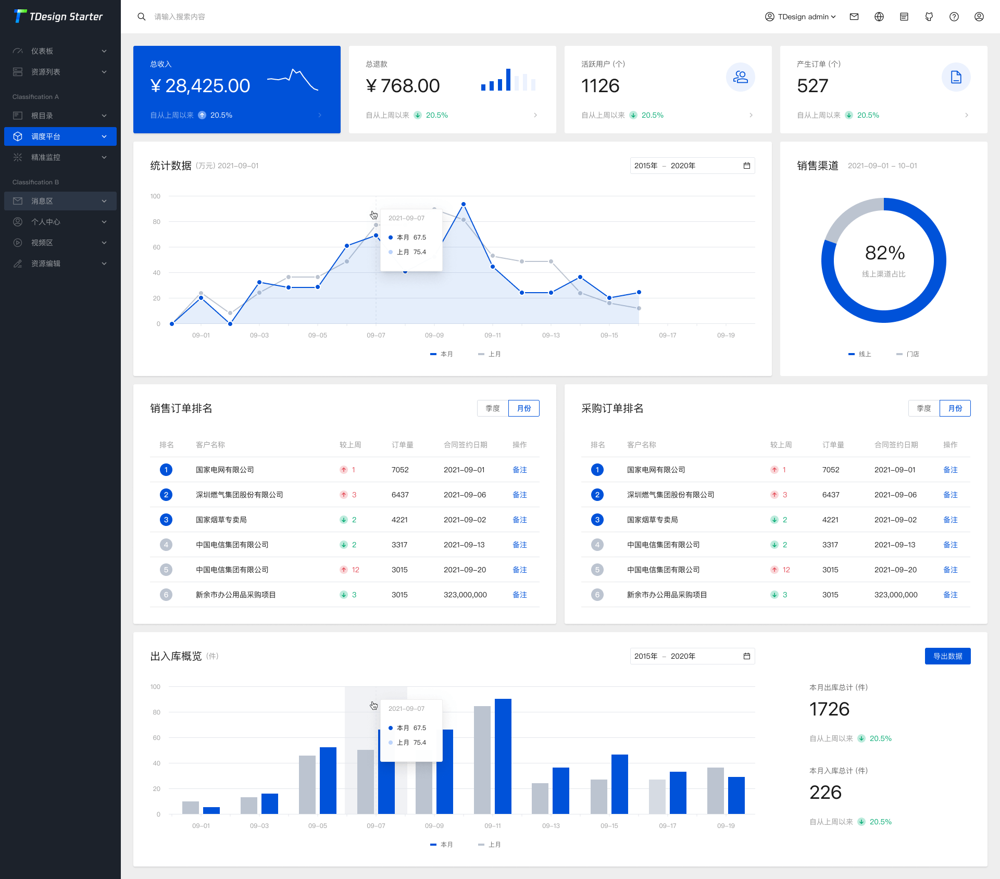

<p style="display:flex; justify-content: center">

</p>
<p align="center">
  <a href="https://tdesign.tencent.com/starter/vue-next/#/dashboard/base" target="_blank">
    
  </a>
</p>

<p align="center">
  <a href="https://nodejs.org/en/about/releases/"></a>
  <a href="https://github.com/Tencent/tdesign-vue-next/blob/develop/LICENSE">
    
  </a>
</p>

English | [简体中文](./README-zh_CN.md) 
### Introduction

TDesign Vue Next Starter is a TDesign-based developed with `Vue 3`, `Vite`, `Pinia`, `TypeScript`. It can be customized theme configuration, and aims to provide project out-of-the-box, configuration-style middle and background projects.

<p>
  <a href="http://tdesign.tencent.com/starter/vue-next/">Live Preview</a>
  ·
  <a href="https://tdesign.tencent.com/starter/">Documentation</a>
</p>



### Features

- Various provided pages for develop
- Complete directory structure for develop
- Code specification configuration
- Support dark mode
- Custom theme colors
- Various space layouts
- Mock data scheme

### Usage

> Initialize project with our CLI tool `tdesign-starter-cli` 

```bash
## install tdesign-starter-cli
npm i tdesign-starter-cli@latest -g

## create project
td-starter init
```

### Develop

```bash
## install dependencies
npm install

## set up
npm run dev
```

### Build

```bash
## build
npm run build

## build for test
npm run build:test
```


### Contributing Guide

We welcome contributions to our project. Create your [Issue](https://github.com/tencent/tdesign-vue-next-starter/issues/new/choose) or Submit your [Pull Request](https://github.com/Tencent/tdesign-vue-next-starter/pulls).

#### Commit Specification

- [Angular Convention](https://github.com/conventional-changelog/conventional-changelog/tree/master/packages/conventional-changelog-angular)
- [Vue Style Guide](https://v3.vuejs.org/style-guide/#rule-categories)

### Browser Support

| [](http://godban.github.io/browsers-support-badges/)</br> IE / Edge | [](http://godban.github.io/browsers-support-badges/)</br>Firefox | [](http://godban.github.io/browsers-support-badges/)</br>Chrome | [](http://godban.github.io/browsers-support-badges/)</br>Safari |
| ---------------------------------------------------------------------------------------------------------------------------------------------------------------------------------------------------------------- | ----------------------------------------------------------------------------------------------------------------------------------------------------------------------------------------------------------------- | ------------------------------------------------------------------------------------------------------------------------------------------------------------------------------------------------------------- | ------------------------------------------------------------------------------------------------------------------------------------------------------------------------------------------------------------- |
| Edge >=84                                                                                                                                                                                                        | Firefox >=83                                                                                                                                                                                                      | Chrome >=84                                                                                                                                                                                                   | Safari >=14.1                                                                                                                                                                                                 |

### Community Versions

There are kinds of community versions of starter-kit based on TDesign Vue Next, visit [community-link](https://tdesign.tencent.com/starter/docs/vue-next/community-link) for more detail. If you developed a community versions of tdesign starter, please create a issue or submit a pull request to let us know 😊.

### License

The MIT License. Please see [the license file](LICENSE) for more information.
